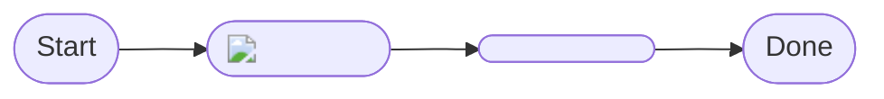
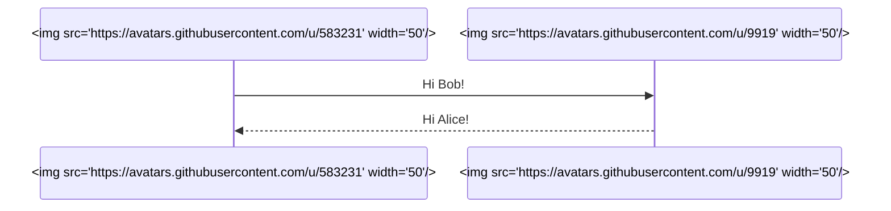
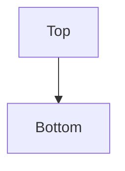
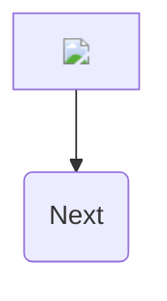
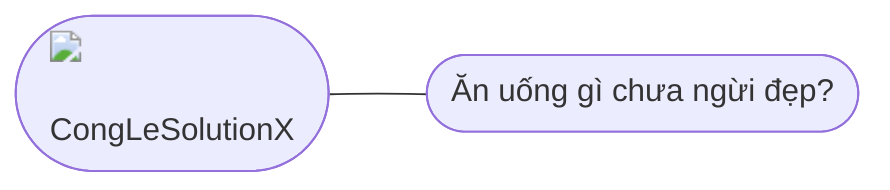
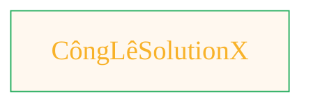

# Designing graphic art in Mermaid syntax

> <ins>📢 **Disclaimer** 🚨</ins>
>
> All the projects with my meme images (as my signature way to label repos based on their functionalities for future review) </br>
> are born from my fascination with blending digital art and artificial intelligence.</br>
> It's where I document my academic explorations,</br>
> share my findings with anyone interested,</br>
> and maintain a personal vault of my creative and technical journey.</br>
> I'm not sure the link for this repo being shared in the back by others,</br>
> since I havent plan for any analytics for this project yet.</br>
> ...and I'm actively looking for a job...</br>

> This document contains my personal notes on the topic,</br>
> compiled from publicly available documentation and various cited sources.
> 
> The materials are intended for educational purposes (<ins>sometimes, entertainment purposes</ins>), personal study, and technical reference.
> The content is dual-licensed:
> 1. **MIT License:** Applies to all code implementations (Swift, Mermaid, and other programming languages).
> 2. **Creative Commons Attribution-ShareAlike 4.0 International License (CC BY-SA 4.0):** Applies to all non-code content, including text, explanations, diagrams, and illustrations.

---


## Flow-chart node that shows an inline image


Mermaid allows basic HTML in node labels.  
That means you can embed an `` tag:



What you get  
• Node B renders as the Octocat icon instead of text.  
• The image travels with the diagram; it is **not** a background for the page.

---


## Sequence diagram with avatars as participants



Each participant heading shows the picture you supply.


----


## Diagram-level background image (CSS injected via init)

This technique attaches a CSS rule to the SVG root that Mermaid outputs.  
Only the diagram canvas gets the background, not the whole README.



Tips  
• Large images may slow down the first render because GitHub caches them on demand.  
• `background-size:cover` keeps the image edge-to-edge inside the SVG.  
• All other styles (grid lines, fonts, etc.) still obey the chosen Mermaid theme.

---


## Node with an SVG logo loaded via a data-URI


Inlining a small image as a data URI avoids separate HTTP requests and guarantees the asset loads even if someone clones your repo privately.



---


## Combining images and regular text in one node


```mermaid
flowchart TD
    My_Meme@{ img: "https://github.com/CongLeSolutionX/MY_GRAPHIC_ASSETS/blob/Designing_graphic_syntax/MY_MEME/My-meme-orange_2.png?raw=true", label: "CongLeSolutionX", pos: "t", w: 200, h: 150, constraint: "on" }

```


---





---


---


```mermaid
flowchart TD
    My_Meme@{ img: "https://github.com/CongLeSolutionX/MY_GRAPHIC_ASSETS/blob/Designing_graphic_syntax/MY_MEME/My-meme-orange-microphone.png?raw=true", label: "CongLeSolutionX", pos: "b", w: 200, h: 150, constraint: "on" }

```


---


```mermaid
---
title: "CongLeSolutionX"
author: "Cong Le"
version: "1.0"
license(s): "MIT, CC BY 4.0"
copyright: "Copyright (c) 2025 Cong Le. All Rights Reserved."
config:
  layout: dagre
  theme: base
---
%%%%%%%% Mermaid version v11.4.1-b.14
%%%%%%%% Available curve styles include the following keywords:
%% basis, bumpX, bumpY, cardinal, catmullRom, linear, monotoneX, monotoneY, natural, step, stepAfter, stepBefore.
%%{
  init: {
    'flowchart': { 'htmlLabels': false, 'curve': 'linear' },
    'fontFamily': 'Comic Sans MS',
    'themeVariables': {
      'primaryColor': '#ffcc80',
      'primaryTextColor': '#111111',
      'lineColor': '#e0e0e0',
      'primaryBorderColor': '#27AE60',
      'secondaryColor': '#81c784',
      'secondaryTextColor': '#6C3483',
      'secondaryBorderColor': '#A569BD',
      'fontSize': '10px'
    }
  }
}%%
flowchart TD
    My_Meme@{ img: "https://github.com/CongLeSolutionX/MY_GRAPHIC_ASSETS/blob/Designing_graphic_syntax/MY_MEME/My-meme-orange-microphone.png?raw=true", label: "Ăn uống gì chưa ngừi đẹp?", pos: "b", w: 200, h: 150, constraint: "on" }

```

---


```mermaid
---
title: "CongLeSolutionX"
author: "Cong Le"
version: "1.0"
license(s): "MIT, CC BY 4.0"
copyright: "Copyright (c) 2025 Cong Le. All Rights Reserved."
config:
  theme: base
---
%%%%%%%% Mermaid version v11.4.1-b.14
%%{
  init: {
    'flowchart': { 'htmlLabels': false },
    'fontFamily': 'Brush Script MT',
    'themeVariables': {
      'primaryColor': '#fc82',
      'primaryTextColor': '#F8B229',
      'primaryBorderColor': '#27AE60',
      'secondaryColor': '#81c784',
      'secondaryTextColor': '#6C3483',
      'fontSize': '15px'
    }
  }
}%%
flowchart TD
    My_Meme@{ img: "https://github.com/CongLeSolutionX/MY_GRAPHIC_ASSETS/blob/Designing_graphic_syntax/MY_MEME_ICONS/Orange-Cloud-Search-Icon-Base-Color-Black-1024x1024.png?raw=true", label: "Ăn uống gì chưa ngừi đẹp?", pos: "b", w: 200, h: 150, constraint: "on" }

```


---


```mermaid
---
title: "CongLeSolutionX"
author: "Cong Le"
version: "1.0"
license(s): "MIT, CC BY 4.0"
copyright: "Copyright (c) 2025 Cong Le. All Rights Reserved."
config:
  theme: base
---
%%%%%%%% Mermaid version v11.4.1-b.14
%%{
  init: {
    'flowchart': { 'htmlLabels': false },
    'fontFamily': 'Brush Script MT',
    'themeVariables': {
      'primaryColor': '#fc82',
      'primaryTextColor': '#F8B229',
      'primaryBorderColor': '#27AE60',
      'secondaryColor': '#81c784',
      'secondaryTextColor': '#6C3483',
      'lineColor': '#F8B229',
      'fontSize': '20px'
    }
  }
}%%
flowchart LR
    My_Meme@{ img: "https://github.com/CongLeSolutionX/MY_GRAPHIC_ASSETS/blob/Designing_graphic_syntax/MY_MEME_ICONS/Orange-Cloud-Search-Icon-Base-Color-Black-1024x1024.png?raw=true", label: "Ăn uống gì chưa ngừi đẹp?", pos: "b", w: 200, h: 150, constraint: "on" }

    Closing_quote@{ shape: braces, label: "Math and code work together to bring interactive art to life!" }

Closing_quote --- My_Meme

```

---


```mermaid
---
title: "CongLeSolutionX"
author: "Cong Le"
version: "1.0"
license(s): "MIT, CC BY 4.0"
copyright: "Copyright (c) 2025 Cong Le. All Rights Reserved."
config:
  theme: base
---
%%%%%%%% Mermaid version v11.4.1-b.14
%%{
  init: {
    'flowchart': { 'htmlLabels': false },
    'fontFamily': 'Brush Script MT',
    'themeVariables': {
      'primaryColor': '#fc82',
      'primaryTextColor': '#F8B229',
      'primaryBorderColor': '#27AE60',
      'secondaryColor': '#81c784',
      'secondaryTextColor': '#6C3483',
      'lineColor': '#F8B229',
      'fontSize': '20px'
    }
  }
}%%
flowchart LR
    My_Meme@{ img: "https://github.com/CongLeSolutionX/MY_GRAPHIC_ASSETS/blob/Designing_graphic_syntax/MY_MEME_ICONS/Orange-Cloud-Search-Icon-Base-Color-Black-1024x1024.png?raw=true", label: "Ăn uống gì chưa ngừi đẹp?", pos: "b", w: 200, h: 150, constraint: "on" }

    Closing_quote@{ shape: braces, label: "Math and code work together to bring interactive art to life!" }

My_Meme ~~~ Closing_quote

```


---


```mermaid
---
title: "CongLeSolutionX"
author: "Cong Le"
version: "1.0"
license(s): "MIT, CC BY 4.0"
copyright: "Copyright (c) 2025 Cong Le. All Rights Reserved."
config:
  theme: base
---
%%%%%%%% Mermaid version v11.4.1-b.14
%%{
  init: {
    'flowchart': { 'htmlLabels': false },
    'fontFamily': 'Bradley Hand',
    'themeVariables': {
      'primaryColor': '#fc82',
      'primaryTextColor': '#F8B229',
      'primaryBorderColor': '#27AE60',
      'secondaryColor': '#81c784',
      'secondaryTextColor': '#6C3483',
      'lineColor': '#F8B229',
      'fontSize': '20px'
    }
  }
}%%
flowchart LR
    My_Meme@{ img: "https://raw.githubusercontent.com/CongLeSolutionX/MY_GRAPHIC_ASSETS/refs/heads/main/MY_MEME/My-meme-ideas.png", label: "Ăn uống gì chưa ngừi đẹp?", pos: "b", w: 200, h: 150, constraint: "on" }

    Closing_quote@{ shape: braces, label: "Design ideas come from from a friend" }

Closing_quote ~~~ My_Meme

```


---


```mermaid
---
title: "CongLeSolutionX"
author: "Cong Le"
version: "1.0"
license(s): "MIT, CC BY 4.0"
copyright: "Copyright (c) 2025 Cong Le. All Rights Reserved."
config:
  theme: base
---
%%%%%%%% Mermaid version v11.4.1-b.14
%%{
  init: {
    'flowchart': { 'htmlLabels': false },
    'fontFamily': 'Bradley Hand',
    'themeVariables': {
      'primaryColor': '#fc82',
      'primaryTextColor': '#F8B229',
      'primaryBorderColor': '#27AE60',
      'secondaryColor': '#81c784',
      'secondaryTextColor': '#6C3483',
      'lineColor': '#F8B229',
      'fontSize': '20px'
    }
  }
}%%
flowchart LR
    My_Meme@{ img: "https://raw.githubusercontent.com/CongLeSolutionX/MY_GRAPHIC_ASSETS/refs/heads/main/MY_MEME/My-meme-ideas.png", label: "Ăn uống gì chưa ngừi đẹp?", pos: "b", w: 200, h: 150, constraint: "on" }

    Closing_quote@{ shape: braces, label: "With the right context,<br/>theory become reality" }

C["<a href='https://github.com/CongLeSolutionX/CongLeSolutionX' target='_blank'>Hit me up at my homepage</a>"]

id1>"<a href='https://github.com/CongLeSolutionX/CongLeSolutionX' target='_blank'>Hit me up at my homepage</a>"]


id2((("<a href='https://github.com/CongLeSolutionX/CongLeSolutionX' target='_blank'>Hit me up at my homepage</a>")))


id3(("<a href='https://github.com/CongLeSolutionX/CongLeSolutionX' target='_blank'>Hit me up at my homepage</a>"))


id4("<a href='https://github.com/CongLeSolutionX/CongLeSolutionX' target='_blank'>Hit me up at my homepage</a>")


Lightning_Bolt@{ shape: bolt, label: "Communication link" }


Closing_quote ~~~ My_Meme

My_Meme --> C


A e1@==> B
  e1@{ animate: true }


```


---


```mermaid
---
title: "CongLeSolutionX"
author: "Cong Le"
version: "1.0"
license(s): "MIT, CC BY 4.0"
copyright: "Copyright (c) 2025 Cong Le. All Rights Reserved."
config:
  theme: base
---
%%%%%%%% Mermaid version v11.4.1-b.14
%%{
  init: {
    'flowchart': { 'htmlLabels': false },
    'fontFamily': 'Bradley Hand',
    'themeVariables': {
      'primaryColor': '#fc82',
      'primaryTextColor': '#F8B229',
      'primaryBorderColor': '#27AE60',
      'secondaryColor': '#81c784',
      'secondaryTextColor': '#6C3483',
      'lineColor': '#F8B229',
      'fontSize': '20px'
    }
  }
}%%
flowchart LR
    My_Meme@{ img: "https://raw.githubusercontent.com/CongLeSolutionX/MY_GRAPHIC_ASSETS/refs/heads/main/MY_MEME/My-meme-ideas.png", label: "Ăn uống gì chưa ngừi đẹp?", pos: "b", w: 200, h: 150, constraint: "on" }

    Closing_quote@{ shape: braces, label: "With the right context,<br/>theory become reality" }

    Link_to_my_profile{{"<a href='https://github.com/CongLeSolutionX/CongLeSolutionX' target='_blank'>Click here if you care about my profile</a>"}}

Closing_quote ~~~ My_Meme
My_Meme animatingEdge@--> Link_to_my_profile
animatingEdge@{ animate: true }


```


---


```mermaid
---
title: "CongLeSolutionX"
author: "Cong Le"
version: "1.0"
license(s): "MIT, CC BY 4.0"
copyright: "Copyright (c) 2025 Cong Le. All Rights Reserved."
config:
  theme: base
---
%%%%%%%% Mermaid version v11.4.1-b.14
%%{
  init: {
    'flowchart': { 'htmlLabels': true },
    'fontFamily': 'Brush Script MT',
    'themeVariables': {
      'primaryColor': '#fc82',
      'primaryTextColor': '#F8B229',
      'primaryBorderColor': '#27AE60',
      'secondaryColor': '#81c784',
      'secondaryTextColor': '#6C3483',
      'lineColor': '#F8B229',
      'fontSize': '20px'
    }
  }
}%%
flowchart LR
    My_Meme@{ img: "https://raw.githubusercontent.com/CongLeSolutionX/MY_GRAPHIC_ASSETS/refs/heads/Designing_graphic_syntax/MY_MEME/My-meme-icon-design.png", label: "Ăn uống gì chưa ngừi đẹp?", pos: "b", w: 200, h: 150, constraint: "on" }

    Closing_quote@{ shape: braces, label: "I'll leave this Earth empty-handed anyway!<br/>YOLO :metal:" }

My_Meme ~~~ Closing_quote

:love_you_gesture:


```

<br/> :metal: <br/> YOLO <br/> :love_you_gesture:


---


```mermaid
---
title: "CHANGE_ME_DADDY"
author: "Cong Le"
version: "1.0"
license(s): "MIT, CC BY 4.0"
copyright: "Copyright (c) 2025 Cong Le. All Rights Reserved."
config:
  layout: dagre
  theme: base
---
%%%%%%%% Mermaid version v11.4.1-b.14
%%%%%%%% Available curve styles include the following keywords:
%% basis, bumpX, bumpY, cardinal, catmullRom, linear, monotoneX, monotoneY, natural, step, stepAfter, stepBefore.
%%{
  init: {
    'flowchart': { 'htmlLabels': false, 'curve': 'basis' },
    'fontFamily': 'Bradley Hand',
    'themeVariables': {
      'primaryColor': '#ffcc80',
      'primaryTextColor': '#000',
      'textColor': '#FFF',
      'lineColor': '#F8B229',
      'primaryBorderColor': '#27AE60',
      'secondaryColor': '#81c784',
      'secondaryTextColor': '#6C3483',
      'secondaryBorderColor': '#A569BD',
      'tertiaryColor': '#ef9a9a',
      'fontSize': '15px'
    }
  }
}%%
flowchart TD
%% Nodes
    A("fab:fa-youtube Starter Guide")
    B("fab:fa-youtube Make Flowchart")
    n1@{ icon: "fa:gem", pos: "b", h: 24}
    
    C("fa:fa-book-open Learn More")
    D{"Use the editor"}
    n2(Many shapes)@{ shape: delay}
    
    E(fa:fa-shapes Visual Editor)
    F("fa:fa-chevron-up Add node in toolbar")
    G("fa:fa-comment-dots AI chat")
    H("fa:fa-arrow-left Open AI in side menu")
    I("fa:fa-code Text")
    J(fa:fa-arrow-left Type Mermaid syntax)

    My_Meme@{ img: "https://github.com/CongLeSolutionX/MY_GRAPHIC_ASSETS/blob/Designing_graphic_syntax/MY_MEME_ICONS/Orange-Cloud-Search-Icon-Base-Color-Black-1024x1024.png?raw=true", label: "Ăn uống gì chưa ngừi đẹp?", pos: "b", w: 200, h: 150, constraint: "on" }


%% Edge connections between nodes
    A --> My_Meme --> B --> C --> n1 & D & n2
    D -- Build and Design --> E --> F
    D -- Use AI --> G --> H
    D -- Mermaid js --> I --> J

%% Individual node styling. Try the visual editor toolbar for easier styling!
    style E color:#FFFFFF, fill:#AA00FF, stroke:#AA00FF
    style G color:#FFFFFF, stroke:#00C853, fill:#00C853
    style I color:#FFFFFF, stroke:#2962FF, fill:#2962FF

%% You can add notes with two "%" signs in a row!
```


----


<!-- 
## Types of web font

Helvetica (sans-serif)
Arial (sans-serif)
Arial Black (sans-serif)
Verdana (sans-serif)
Tahoma (sans-serif)
Trebuchet MS (sans-serif)
Impact (sans-serif)
Gill Sans (sans-serif)
Times New Roman (serif)
Georgia (serif)
Palatino (serif)
Baskerville (serif)
Andalé Mono (monospace)
Courier (monospace)
Lucida (monospace)
Monaco (monospace)
Bradley Hand (cursive)
Brush Script MT (cursive)
Luminari (fantasy)
Comic Sans MS (cursive) 
-->


~~~mermaid
---
title: "High-Level System Overview"
author: "Cong Le"
version: "1.0"
license(s): "MIT, CC BY 4.0"
copyright: "Copyright (c) 2025 Cong Le. All Rights Reserved."
config:
  layout: elk
  theme: base
  look: handDrawn
---
%%%%%%%% Mermaid version v11.4.1-b.14
%%%%%%%% Available curve styles include the following keywords:
%% basis, bumpX, bumpY, cardinal, catmullRom, linear, monotoneX, monotoneY, natural, step, stepAfter, stepBefore.
%%{
  init: {
    'flowchart': { 'htmlLabels': true, 'curve': 'basis' },
    'fontFamily': 'Monaco',
    'themeVariables': {
      'primaryColor': '#22BB',
      'primaryTextColor': '#F8B229',
      'lineColor': '#F8B229',
      'primaryBorderColor': '#27AE60',
      'secondaryColor': '#6483',
      'secondaryTextColor': '#6C3483',
      'secondaryBorderColor': '#A569BD',
      'fontSize': '15px'
    }
  }
}%%
flowchart LR
    User@{ img: "https://github.com/CongLeSolutionX/MY_GRAPHIC_ASSETS/blob/Designing_graphic_syntax/MY_MEME_ICONS/Orange-Cloud-Search-Icon-Base-Color-Black-1024x1024.png?raw=true", label: "User", pos: "b", w: 100, h: 100, constraint: "on" }

    User -- Speaks Vietnamese --> SpeechRecognizer
    SpeechRecognizer -- Transcribes --> AICardView(("AICardView"))
    AICardView -- Contains --> UserInterface
    AICardView -- Handles Input --> RecordingController
    AICardView -- Handles Output --> PlaybackController
    AICardView -- Triggers --> AIInteraction
    AIInteraction -- Calls --> LLMModel(LLM Framework)
    LLMModel -- Processes Question --> AIResponse
    AIResponse -- Returns to --> AIInteraction
    AIInteraction -- Updates --> AICardView
    AICardView -- Displays --> AIResponse
    AICardView -- Sends to --> TextToSpeech
    TextToSpeech -- Speaks Vietnamese --> User

    subgraph Voice_Input["Voice Input"]
    style Voice_Input fill:#c322,stroke:#333,stroke-width:1px, color:#FFFF
    direction LR
        SpeechRecognizer
        RecordingController
    end

    subgraph Voice_Output["Voice Output"]
    style Voice_Output fill:#c1d2,stroke:#333,stroke-width:1px, color:#FFFF
    direction LR
        TextToSpeech
        PlaybackController
    end

    style LLMModel fill:#212,stroke:#333,stroke-width:2px
    style AICardView fill:#c229,stroke:#333,stroke-width:2px

~~~


----


```mermaid
---
title: "CongLeSolutionX"
author: "Cong Le"
version: "1.0"
license(s): "MIT, CC BY 4.0"
copyright: "Copyright (c) 2025 Cong Le. All Rights Reserved."
config:
  theme: base
  look: handDrawn
---
%%%%%%%% Mermaid version v11.4.1-b.14
%%{
  init: {
    'flowchart': { 'htmlLabels': false },
    'fontFamily': 'Bradley Hand',
    'themeVariables': {
      'primaryColor': '#fc82',
      'primaryTextColor': '#F8B229',
      'primaryBorderColor': '#27AE60',
      'secondaryColor': '#8784',
      'secondaryTextColor': '#6C3483',
      'lineColor': '#F8B229',
      'fontSize': '20px'
    }
  }
}%%
flowchart LR
    My_Meme@{ img: "https://raw.githubusercontent.com/CongLeSolutionX/CongLeSolutionX/refs/heads/main/assets/images/My-meme-oranges-and-orange-slices.png", label: "C<char>o#770;</char>ngL<char>e#770;</char>SolutionX", pos: "b", w: 200, h: 150, constraint: "on" }

    Closing_quote@{ shape: braces, label: "With the right context,<br/>theory become reality" }

    Link_to_my_profile{{"<a href='https://github.com/CongLeSolutionX/CongLeSolutionX' target='_blank'>Click here if you care about my profile</a>"}}


My_Meme:::Style_To_Test

Closing_quote ~~~ My_Meme
My_Meme animatingEdge@--> Link_to_my_profile
animatingEdge@{ animate: true }


classDef Style_To_Test fill:#F2F2,stroke:#333,stroke-width:2px, color: #27AE60

```

---





---


## Key limitations (current GitHub renderer)


1. Markdown itself still has no notion of “page background.”  
2. GitHub strips any `<style>` blocks that you put *outside* Mermaid; only the `themeCSS` JSON key is honoured.  
3. Only HTTPS or `data:` images render—no `file:` or `blob:` links.  
4. All CSS you inject is scoped to the `<svg class="mermaid">…</svg>` element of that diagram, so it cannot leak into the rest of the README.

---
>
>**Licenses:**
>
>- **MIT License:**  [](LICENSE) - Full text in [LICENSE](LICENSE) file.
>- **Creative Commons Attribution 4.0 International:** [](LICENSE-CC-BY) - Legal details in [LICENSE-CC-BY](LICENSE-CC-BY) and at [Creative Commons official site](http://creativecommons.org/licenses/by/4.0/).
>
---
