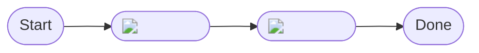
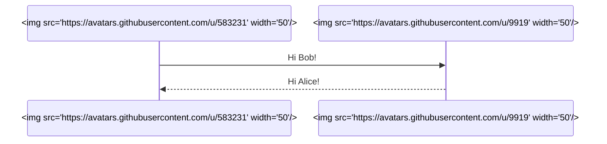
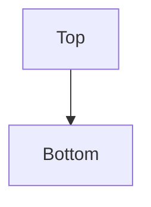
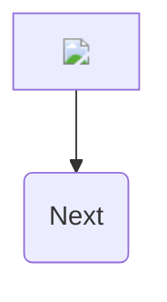

---

# Designing graphic art in Mermaid syntax

## Flow-chart node that shows an inline image

Mermaid allows basic HTML in node labels.  
That means you can embed an `` tag:

What you get  
• Node B renders as the Octocat icon instead of text.  
• The image travels with the diagram; it is **not** a background for the page.

---

## Sequence diagram with avatars as participants

Each participant heading shows the picture you supply.

----

## Diagram-level background image (CSS injected via init)

This technique attaches a CSS rule to the SVG root that Mermaid outputs.  
Only the diagram canvas gets the background, not the whole README.

Tips  
• Large images may slow down the first render because GitHub caches them on demand.  
• `background-size:cover` keeps the image edge-to-edge inside the SVG.  
• All other styles (grid lines, fonts, etc.) still obey the chosen Mermaid theme.

---

## Node with an SVG logo loaded via a data-URI

Inlining a small image as a data URI avoids separate HTTP requests and guarantees the asset loads even if someone clones your repo privately.

---

## Combining images and regular text in one node

---

## Key limitations (current GitHub renderer)

1. Markdown itself still has no notion of “page background.”  
2. GitHub strips any `<style>` blocks that you put *outside* Mermaid; only the `themeCSS` JSON key is honoured.  
3. Only HTTPS or `data:` images render—no `file:` or `blob:` links.  
4. All CSS you inject is scoped to the `<svg class="mermaid">…</svg>` element of that diagram, so it cannot leak into the rest of the README.

