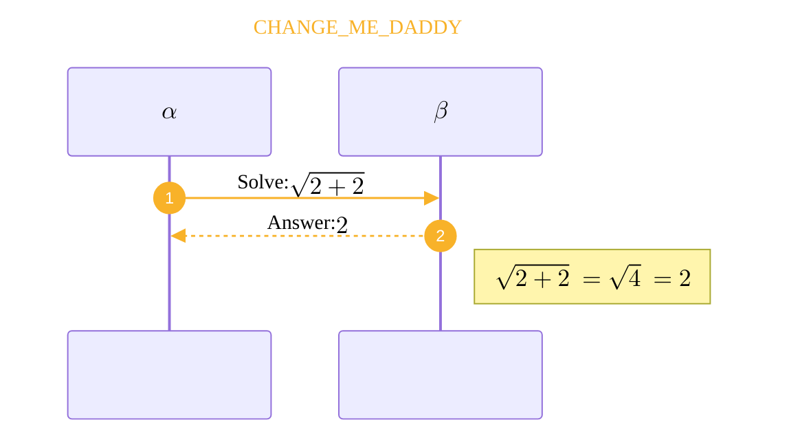
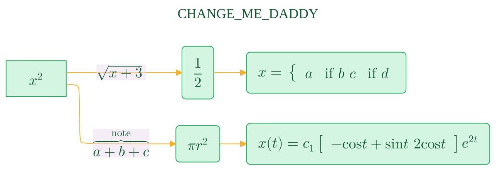

# CHANGE_ME
> This content is dual-licensed under your choice of the following licenses:
> 1.  **MIT License:** For the code implementations in Swift and Mermaid provided in this document.
> 2.  **Creative Commons Attribution 4.0 International License (CC BY 4.0):** For all other content, including the text, explanations, and the Mermaid diagrams and illustrations.

---





-----





----


## [Writing expressions as blocks](https://docs.github.com/en/get-started/writing-on-github/working-with-advanced-formatting/writing-mathematical-expressions#writing-expressions-as-blocks)


````
**The Cauchy-Schwarz Inequality**\
$$\left( \sum_{k=1}^n a_k b_k \right)^2 \leq \left( \sum_{k=1}^n a_k^2 \right) \left( \sum_{k=1}^n b_k^2 \right)$$
````

**The Cauchy-Schwarz Inequality**\
$$\left( \sum_{k=1}^n a_k b_k \right)^2 \leq \left( \sum_{k=1}^n a_k^2 \right) \left( \sum_{k=1}^n b_k^2 \right)$$

Alternatively, you can use the `/```math` code block syntax to display a math expression as a block. With this syntax, you don't need to use `$$` delimiters. The following will render the same as above:


**The Cauchy-Schwarz Inequality**

````
```math
\left( \sum_{k=1}^n a_k b_k \right)^2 \leq \left( \sum_{k=1}^n a_k^2 \right) \left( \sum_{k=1}^n b_k^2 \right)
```
````


```math
\left( \sum_{k=1}^n a_k b_k \right)^2 \leq \left( \sum_{k=1}^n a_k^2 \right) \left( \sum_{k=1}^n b_k^2 \right)
```


---


> [!TIP]
> For math syntax reference: https://en.wikibooks.org/wiki/LaTeX/Mathematics
>

---

```math
\mathfrak{Testing math font}
```

```math
\mathscr{Testing math font}
```


```math
\mathcal{Testing math font}
```


```math
\mathbb{Testing math font}
```


----


```math
\boldsymbol{\beta} = (\beta_1,\beta_2,\dotsc,\beta_n)
```


---
**Licenses:**

- **MIT License:**  [](LICENSE) - Full text in [LICENSE](LICENSE) file.
- **Creative Commons Attribution 4.0 International:** [](LICENSE-CC-BY) - Legal details in [LICENSE-CC-BY](LICENSE-CC-BY) and at [Creative Commons official site](http://creativecommons.org/licenses/by/4.0/).

---