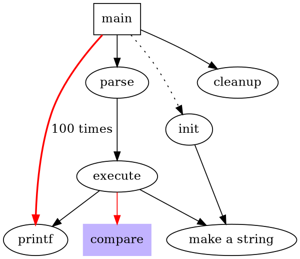

# Experimental syntax with Github Camo crawler bot
> This content is dual-licensed under your choice of the following licenses:
> 1.  **MIT License:** For the code implementations in Swift and Mermaid provided in this document.
> 2.  **Creative Commons Attribution 4.0 International License (CC BY 4.0):** For all other content, including the text, explanations, and the Mermaid diagrams and illustrations.

---

## Simple html tag

 parse -> execute;
   main -> init;
   main -> cleanup;
   execute -> make_string;
   execute -> printf
   init -> make_string;
   main -> printf;
   execute -> compare;
 }
'/>

---

## Using markdown syntax in github.com

---

## Samples

 A: DoWork;
activate A;

A -> B: Create Request;
activate B;

B -> C: DoWork;
activate C;

C --> B: WorkDone;
destroy C;

B --> A: Request Created;
deactivate B;

A --> User: Done;
deactivate A;

@enduml
'>

---

## Using my techniques
<!-- 
https%3A%2F%2Fraw.githubusercontent.com%2FCongLeSolutionX%2FMY_GRAPHIC_ASSETS%2Frefs%2Fheads%2FDesigning_graphic_syntax%2FDesigning_Graphic_Syntax%2FGithub_camo_bot.md -->

---

### DOT syntax example

Rendered code for DOT syntax example, by Github Camo crawler bot

rendered_code_dot_syntax_example

digraph G {
    size ="4,4"
    main [shape=box]
    main -> parse [weight=8]
    parse -> execute
    main -> init [style=dotted]
    main -> cleanup
    execute -> { make_string; printf}
    init -> make_string
    edge [color=red]
    main -> printf [style=bold,label="100 times"]
    make_string [label="make a string"]
    node [shape=box,style=filled,color=".7 .3 1.0"]
    execute -> compare
  }

rendered_code_dot_syntax_example

Click to show/hide the full native DOT implementation with comment documentation.

----

### PlantUML diagram example

Rendered code for PlantUML diagram example, by Github Camo crawler bot

my_plant_uml_diagram_example

@startuml
participant Participant as Foo
actor       Actor       as Foo1
boundary    Boundary    as Foo2
control     Control     as Foo3
entity      Entity      as Foo4
database    Database    as Foo5
collections Collections as Foo6
queue       Queue       as Foo7
Foo -> Foo1 : To actor 
Foo -> Foo2 : To boundary
Foo -> Foo3 : To control
Foo -> Foo4 : To entity
Foo -> Foo5 : To database
Foo -> Foo6 : To collections
Foo -> Foo7: To queue
@enduml

my_plant_uml_diagram_example

----

### PlantUML diagram example 2

Rendered code for PlantUML diagram example, by Github Camo crawler bot

my_second_plant_uml_diagram_example

participant Participant as Foo
actor       Actor       as Foo1
boundary    Boundary    as Foo2
control     Control     as Foo3
entity      Entity      as Foo4
database    Database    as Foo5
collections Collections as Foo6
queue       Queue       as Foo7
Foo -> Foo1 : To actor 
Foo -> Foo2 : To boundary
Foo -> Foo3 : To control
Foo -> Foo4 : To entity
Foo -> Foo5 : To database
Foo -> Foo6 : To collections
Foo -> Foo7: To queue

my_second_plant_uml_diagram_example

-----

### Creole and HTML

Rendered code for Creole and HTML example, by Github Camo crawler bot

rendered_code_for_creole_and_html_example

@startuml
participant Alice
participant "The **Famous** Bob" as Bob

Alice -> Bob : hello --there--
... Some ~~long delay~~ ...
Bob -> Alice : ok
note left
  This is **bold**
  This is //italics//
  This is ""monospaced""
  This is --stroked--
  This is __underlined__
  This is ~~waved~~
end note

Alice -> Bob : A //well formatted// message
note right of Alice
 This is <back:cadetblue><size:18>displayed</size></back>
 __left of__ Alice.
end note
note left of Bob
 <u:red>This</u> is <color #118888>displayed</color>
 **<color purple>left of</color> <s:red>Alice</strike> Bob**.
end note
note over Alice, Bob
 <w:#FF33FF>This is hosted</w> by 
end note
@enduml

rendered_code_for_creole_and_html_example

----

### Custom svg code block

 

Rendered code for My custom svg code block example, by Github Camo crawler bot

my_custom_svg_code_example

{"svg": {
		"@height": "450",
		"@width": "450", 
		"path": [
			{"@id":"lineAB", "@d": "M 100 350 l 150 -300", "@stroke":"red"},
			{"@id":"lineBC", "@d": "M 250 50 l 150 300", "@stroke":"red"},
			{"@d":"M 100 350 q 150 -300 300 0", "@stroke":"blue", "@fill":"none"}
    ],
		"g": [
			{"@stroke":"black", "circle":[  
				{"@id":"pointA", "@cx":"100", "@cy":"350", "@r":"3"},
				{"@id":"pointB", "@cx":"250", "@cy":"50", "@r":"3"},
				{"@id":"pointC", "@cx":"400", "@cy":"350", "@r":"3"}
			]},
			{"text": [
				{"@x":"100", "@y":"350", "@dx":"-30", "$":"A"},
				{"@x":"250", "@y":"50", "@dy":"-10", "$":"B"},
				{"@x":"400", "@y":"350", "@dx":"30", "$":"C"}
			]}
		]
	}
}

my_custom_svg_code_example

---
**Licenses:**

- **MIT License:**   - Full text in [LICENSE](LICENSE) file.
- **Creative Commons Attribution 4.0 International:**  - Legal details in [LICENSE-CC-BY](LICENSE-CC-BY) and at [Creative Commons official site](http://creativecommons.org/licenses/by/4.0/).

---