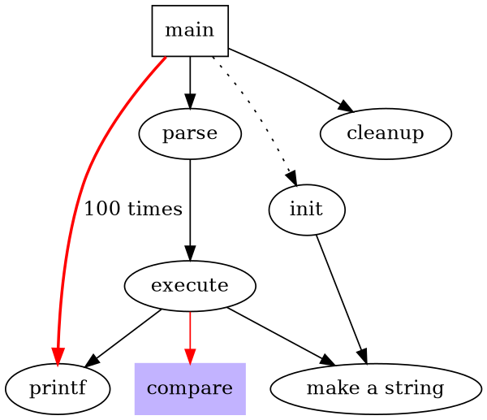
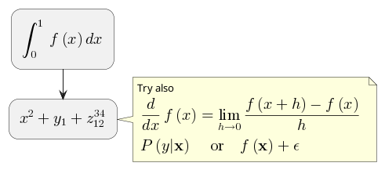
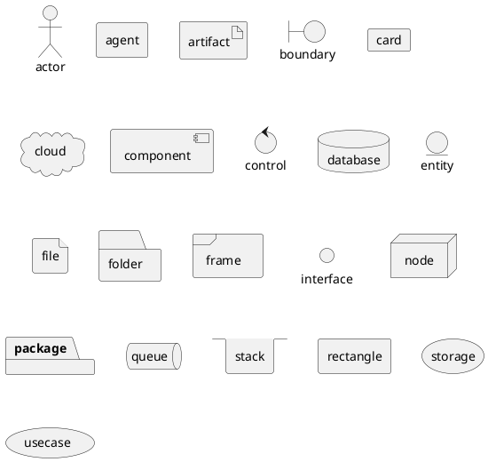

# Experimental syntax with Github Camo crawler bot
> This content is dual-licensed under your choice of the following licenses:
> 1.  **MIT License:** For the code implementations in Swift and Mermaid provided in this document.
> 2.  **Creative Commons Attribution 4.0 International License (CC BY 4.0):** For all other content, including the text, explanations, and the Mermaid diagrams and illustrations.

---

<!-- 
https%3A%2F%2Fraw.githubusercontent.com%2FCongLeSolutionX%2FMY_GRAPHIC_ASSETS%2Frefs%2Fheads%2FDesigning_graphic_syntax%2FDesigning_Graphic_Syntax%2FGithub_camo_bot.md -->


---

# DOT syntax

## DOT syntax example


<details>

<summary>Rendered code for DOT syntax example, by Github Camo crawler bot</summary>
rendered_code_dot_syntax_example

digraph G {
    size ="4,4"
    main [shape=box]
    main -> parse [weight=8]
    parse -> execute
    main -> init [style=dotted]
    main -> cleanup
    execute -> { make_string; printf}
    init -> make_string
    edge [color=red]
    main -> printf [style=bold,label="100 times"]
    make_string [label="make a string"]
    node [shape=box,style=filled,color=".7 .3 1.0"]
    execute -> compare
  }

rendered_code_dot_syntax_example

</details>

<details open>
<summary>Click to show/hide the full native DOT implementation with comment documentation.</summary>



</details>


----


# PlantUML[^1]

[^1]: PlantUML website: https://plantuml.com/sitemap

----


## PlantUML diagram example - Syntax style 1


<details>

<summary>Rendered code for PlantUML diagram example, by Github Camo crawler bot</summary>

my_plant_uml_diagram_example

@startuml
participant Participant as Foo
actor       Actor       as Foo1
boundary    Boundary    as Foo2
control     Control     as Foo3
entity      Entity      as Foo4
database    Database    as Foo5
collections Collections as Foo6
queue       Queue       as Foo7
Foo -> Foo1 : To actor 
Foo -> Foo2 : To boundary
Foo -> Foo3 : To control
Foo -> Foo4 : To entity
Foo -> Foo5 : To database
Foo -> Foo6 : To collections
Foo -> Foo7: To queue
@enduml

my_plant_uml_diagram_example

</details>

----

## PlantUML diagram example - Syntax style 2


<details>

<summary>Rendered code for PlantUML diagram example, by Github Camo crawler bot</summary>

my_second_plant_uml_diagram_example

participant Participant as Foo
actor       Actor       as Foo1
boundary    Boundary    as Foo2
control     Control     as Foo3
entity      Entity      as Foo4
database    Database    as Foo5
collections Collections as Foo6
queue       Queue       as Foo7
Foo -> Foo1 : To actor 
Foo -> Foo2 : To boundary
Foo -> Foo3 : To control
Foo -> Foo4 : To entity
Foo -> Foo5 : To database
Foo -> Foo6 : To collections
Foo -> Foo7: To queue

my_second_plant_uml_diagram_example

</details>

-----


## Creole and HTML


<details>

<summary>Rendered code for Creole and HTML example, by Github Camo crawler bot</summary>

rendered_code_for_creole_and_html_example

@startuml
participant Alice
participant "The **Famous** Bob" as Bob

Alice -> Bob : hello --there--
... Some ~~long delay~~ ...
Bob -> Alice : ok
note left
  This is **bold**
  This is //italics//
  This is ""monospaced""
  This is --stroked--
  This is __underlined__
  This is ~~waved~~
end note

Alice -> Bob : A //well formatted// message
note right of Alice
 This is <back:cadetblue><size:18>displayed</size></back>
 __left of__ Alice.
end note
note left of Bob
 <u:red>This</u> is <color #118888>displayed</color>
 **<color purple>left of</color> <s:red>Alice</strike> Bob**.
end note
note over Alice, Bob
 <w:#FF33FF>This is hosted</w> by 
end note
@enduml

rendered_code_for_creole_and_html_example

</details>


----


## Maths

Within PlantUML, you can use AsciiMath notation:


<details>

<summary>Rendered code for AsciiMath notation example, by Github Camo crawler bot</summary>

rendered_code_for_ascii_math_notation_example

@startuml
:<math>int_0^1f(x)dx</math>;
:<math>x^2+y_1+z_12^34</math>;
note right
Try also
<math>d/dxf(x)=lim_(h->0)(f(x+h)-f(x))/h</math>
<math>P(y|bb"x") or f(bb"x")+epsilon</math>
end note
@enduml

rendered_code_for_ascii_math_notation_example

</details>


<details open>
<summary>Click to show/hide the full native PlantUML implementation with comment documentation.</summary>



</details>


----


# PlantUML Hitchhikers Guide[^2]

[^2]: PlantUML Hitchhikers Guide: https://crashedmind.github.io/PlantUMLHitchhikersGuide/index.html

----

## PlantUML Features

### Use Images in Diagrams[^3]

[^3]: Use Images in Diagrams: https://crashedmind.github.io/PlantUMLHitchhikersGuide/PlantUMLSpriteLibraries/plantuml_sprites.html#use-images-in-diagrams


#### Deployment Diagram Elements


<details>

<summary>Rendered code for Deployment Diagram Elements example, by Github Camo crawler bot</summary>

rendered_code_for_deployment_diagram_elements

@startuml
actor actor
agent agent
artifact artifact
boundary boundary
card card
cloud cloud
component component
control control
database database
entity entity
file file
folder folder
frame frame
interface  interface
node node
package package
queue queue
stack stack
rectangle rectangle
storage storage
usecase usecase
@enduml

rendered_code_for_deployment_diagram_elements

</details>


<details open>
<summary>Click to show/hide the full native PlantUML implementation.</summary>



</details>


---


## Google Cloud Platform [^4]

[^4]: Google Cloud Platform: https://crashedmind.github.io/PlantUMLHitchhikersGuide/gcp/gcp.html

---


<details>

<summary>Rendered code for Google Cloud Platform example, by Github Camo crawler bot</summary>

rendered_code_for_google_cloud_platform_example

@startuml
!define GCPPuml https://raw.githubusercontent.com/Crashedmind/PlantUML-icons-GCP/master/dist
!include GCPPuml/GCPCommon.puml
!include GCPPuml/Compute/Cloud_Functions.puml
!include GCPPuml/Networking/Cloud_Firewall_Rules.puml
!include GCPPuml/Compute/Compute_Engine.puml
!include GCPPuml/Storage/Cloud_Storage.puml

/'
The other icons will need to come from other stdlib libraries: backup, users, clients.
'/
!include <awslib/AWSCommon>
!include <awslib/AWSSimplified.puml>
!include <awslib/Compute/all.puml>
!include <awslib/mobile/all.puml>
!include <awslib/general/all.puml>

!include <material/common>
!include <material/timer.puml>

'skinparam linetype polyline
 skinparam linetype ortho

'top to bottom direction 
package "Kid / Owner" {
    Users(Users, "Friends", " ")
    Client(Client, "Kid / Owner", " ")
}

package "MinecraftClients" {
    Client(ClientMinecraft, "", " ")
    Mobile(Mobile, "", " ")
}

package "Minecraft Project" {

    together {
    Cloud_Functions(Cloud_FunctionsStart, "Start Server", "Cloud Functions")
    Cloud_Functions(Cloud_FunctionsStop, "Stop Server", "Cloud Functions")
    Cloud_Functions(Cloud_FunctionAdd, "Add a Friend", "Cloud Functions")
    }
    Compute_Engine(Compute_Engine, "MineCraft Server", "Compute Engine")

    Cloud_Storage(Cloud_Storage, "MineCraft Backups", "Cloud Storage")

    together {
    Cloud_Firewall_Rules(Cloud_Firewall_Rules_Starter,"Starter FW Entries", "Cloud Firewall Rules")
    Cloud_Firewall_Rules(Cloud_Firewall_Rules_Friend,"Friend FW Entries", "Cloud Firewall Rules")
    }
    
    'https://github.com/Crashedmind/PlantUML-icons-GCP/blob/master/source/GCPCommon.puml
    'rectangle  "==Backup\n MA_TIMER(darkgreen)\n//<size:12>[Cron Task]</size>// " as Backup
    
    EntityColoring("Backup")
    Entity("Backup", "Backup","Cron Task", "darkgrey", "ma_timer", "Backup")
}

Cloud_FunctionsStart -[hidden]d-> Cloud_FunctionsStop
Cloud_FunctionsStop -[hidden]d-> Cloud_FunctionAdd

Cloud_FunctionsStart -d-> Cloud_Firewall_Rules_Starter
Cloud_FunctionAdd -d-> Cloud_Firewall_Rules_Friend
Cloud_Firewall_Rules_Friend -[hidden]d-> Cloud_Firewall_Rules_Starter

Cloud_FunctionsStart -> Compute_Engine
Cloud_FunctionsStop -> Compute_Engine
Compute_Engine -d-> Cloud_Storage

Client -r-> Cloud_FunctionsStart
Client -r-> Cloud_FunctionsStop
Users -r-> Cloud_FunctionAdd

ClientMinecraft -r-> Cloud_Firewall_Rules_Friend

Backup -u-> Compute_Engine
@enduml

rendered_code_for_google_cloud_platform_example

</details>


```plantuml
@startuml
!define GCPPuml https://raw.githubusercontent.com/Crashedmind/PlantUML-icons-GCP/master/dist
!include GCPPuml/GCPCommon.puml
!include GCPPuml/Compute/Cloud_Functions.puml
!include GCPPuml/Networking/Cloud_Firewall_Rules.puml
!include GCPPuml/Compute/Compute_Engine.puml
!include GCPPuml/Storage/Cloud_Storage.puml

/'
The other icons will need to come from other stdlib libraries: backup, users, clients.
'/
!include <awslib/AWSCommon>
!include <awslib/AWSSimplified.puml>
!include <awslib/Compute/all.puml>
!include <awslib/mobile/all.puml>
!include <awslib/general/all.puml>

!include <material/common>
!include <material/timer.puml>

'skinparam linetype polyline
 skinparam linetype ortho

'top to bottom direction 
package "Kid / Owner" {
    Users(Users, "Friends", " ")
    Client(Client, "Kid / Owner", " ")
}

package "MinecraftClients" {
    Client(ClientMinecraft, "", " ")
    Mobile(Mobile, "", " ")
}

package "Minecraft Project" {

    together {
    Cloud_Functions(Cloud_FunctionsStart, "Start Server", "Cloud Functions")
    Cloud_Functions(Cloud_FunctionsStop, "Stop Server", "Cloud Functions")
    Cloud_Functions(Cloud_FunctionAdd, "Add a Friend", "Cloud Functions")
    }
    Compute_Engine(Compute_Engine, "MineCraft Server", "Compute Engine")

    Cloud_Storage(Cloud_Storage, "MineCraft Backups", "Cloud Storage")

    together {
    Cloud_Firewall_Rules(Cloud_Firewall_Rules_Starter,"Starter FW Entries", "Cloud Firewall Rules")
    Cloud_Firewall_Rules(Cloud_Firewall_Rules_Friend,"Friend FW Entries", "Cloud Firewall Rules")
    }
    
    'https://github.com/Crashedmind/PlantUML-icons-GCP/blob/master/source/GCPCommon.puml
    'rectangle  "==Backup\n MA_TIMER(darkgreen)\n//<size:12>[Cron Task]</size>// " as Backup
    
    EntityColoring("Backup")
    Entity("Backup", "Backup","Cron Task", "darkgrey", "ma_timer", "Backup")
}

Cloud_FunctionsStart -[hidden]d-> Cloud_FunctionsStop
Cloud_FunctionsStop -[hidden]d-> Cloud_FunctionAdd

Cloud_FunctionsStart -d-> Cloud_Firewall_Rules_Starter
Cloud_FunctionAdd -d-> Cloud_Firewall_Rules_Friend
Cloud_Firewall_Rules_Friend -[hidden]d-> Cloud_Firewall_Rules_Starter

Cloud_FunctionsStart -> Compute_Engine
Cloud_FunctionsStop -> Compute_Engine
Compute_Engine -d-> Cloud_Storage


Client -r-> Cloud_FunctionsStart
Client -r-> Cloud_FunctionsStop
Users -r-> Cloud_FunctionAdd


ClientMinecraft -r-> Cloud_Firewall_Rules_Friend

Backup -u-> Compute_Engine
@enduml

```


---


---
**Licenses:**

- **MIT License:**  [](LICENSE) - Full text in [LICENSE](LICENSE) file.
- **Creative Commons Attribution 4.0 International:** [](LICENSE-CC-BY) - Legal details in [LICENSE-CC-BY](LICENSE-CC-BY) and at [Creative Commons official site](http://creativecommons.org/licenses/by/4.0/).

---