> ⚠️🏗️🚧🦺🧱🪵🪨🪚🛠️👷
> 
> This is a working draft in progress
> 
> 
>
> gif image is provided by [Giphy](https://giphy.com)
> 
> ⚠️🏗️🚧🦺🧱🪵🪨🪚🛠️👷


----


# HTML Entity Number in decimal representation inside Mermaid diagrams
<details open>
<summary>Click to show/hide the full disclaimer.</summary>
   
> <ins>📢 **Disclaimer** 🚨</ins>
>
> This is a sketch book where I actively experiment and try new techniques<br/>
> and get result in realtime for faster development.</br>
> It's where I document my academic explorations,</br>
> share my findings with anyone interested,</br>
> and maintain a personal vault of my creative and technical journey.</br>
> I'm not sure the link for this repo being shared in the back by others,</br>
> since I havent plan for any analytics for this project yet.</br>
> ...and I'm actively looking for a job...</br>

> This document contains my personal notes on the topic,</br>
> compiled from publicly available documentation and various cited sources.
> 
> The materials are intended for educational purposes (<ins>sometimes, entertainment purposes</ins>), personal study, and technical reference.
> The content is dual-licensed:
> 1. **MIT License:** Applies to all code implementations (Swift, Mermaid, and other programming languages).
> 2. **Creative Commons Attribution-ShareAlike 4.0 International License (CC BY-SA 4.0):** Applies to all non-code content, including text, explanations, diagrams, and illustrations.

</details>


----

## 📜 Overview: What are HTML Special Characters?

In HTML, certain characters are "reserved" because they are part of the language's syntax (like `<` and `>`). To display these characters literally, or to show symbols not found on a standard keyboard (like © or €), we use special codes called **HTML Entities**. Think of them as a "secret code" the browser understands to render a specific symbol correctly.

Let's start with a mind map to see the big picture.

```mermaid
---
title: "What are HTML Special Characters?"
author: "Cong Le"
version: "1.0"
license(s): "MIT, CC BY-SA 4.0"
copyright: "Copyright © 2025 Cong Le. All Rights Reserved."
config:
  theme: base
---
%%%%%%%% Mermaid version v11.4.1-b.14
%%{
  init: {
    'fontFamily': 'American Typewriter, monospace',
    'logLevel': 'fatal',
    'mindmap': {
	    'nodeAlign': 'center',
	    'padding': 20
    },
    'themeVariables': {
      'primaryColor': '#FC82',
      'primaryTextColor': '#F8B229',
      'primaryBorderColor': '#27AE60',
      'secondaryColor': '#EBF3',
      'secondaryTextColor': '#6C3483',
      'secondaryBorderColor': '#A569BD',
      'fontSize': '20px'
    }
  }
}%%
mindmap
  root)"**HTML Special Characters**"(
    What_are_they))"**What are they?** 🧐"((
    ::icon(fa fa-commenting)
      Codes_for_special_symbols("Codes for special symbols")
      Also_called("Also called **HTML Entities** or **Character References**")
      Ensures correct display in browsers
    Why_use_them))"**Why use them?** 🤔"((
    ::icon(fa fa-question)
        Reserved Characters
        ::icon(fa fa-language)
            To avoid confusing the browser (e.g., `<` for tags)
        Non-Keyboard Characters
        ::icon(fa fa-keyboard)
            To display symbols like ©, ®, €, ™
        Accented Characters
        ::icon(fa fa-language)
            For letters like á, ñ, ü
        Cross-Browser Compatibility
        ::icon(fa fa-share)
            Guarantees consistent rendering everywhere
    How_to_write_them))"**How to write them?** ✍️"((
    ::icon(fa fa-pencil)
        All_entities["All entities start with `&` and end with `;`"]
        Three_primary_formats{{"3️⃣ primary formats"}}
            Entity_Name))"**Entity Name**"((
            ::icon(fa fa-font)
                Descriptive_and_readable("Descriptive & readable<br/>(e.g., `&copy;`)")
            Entity_Number))"**Entity Number** <br/>(Decimal)"((
            ::icon(fa fa-icon)
                Numeric_code["Numeric code<br/>(e.g., `#169;`)"]
            Entity_Number))"**Entity Number**<br/>(Hexadecimal)"((
            ::icon(fa fa-info)
                Hex_code["Hex code, starts with `&#x`<br/>(e.g., `&#xa9;`)"]

```



> [!note]
> As you can see, normal structure format of the HTML entity in decimal representation do not display properly when nested inside Mermaid mind map. The solution for this issue is below.

---

## ⚙️ The Anatomy of an HTML Entity

Every HTML entity follows a specific structure. Let's break it down visually using Graphviz DOT Language to see the components of the Copyright symbol (`©`) in both its named and numbered forms.

**1. Entity Name (`&copy;`)**


**2. Entity Number (`&#169;`)**


As you can see, the core structure is an `&` at the beginning and a `;` at the end, with the specific code sandwiched in between.

> [!note]
> The Structure of HTML Entity Number can be used in Mermaid mind map look like this example `#34;`

-----

## ❓ Developer's Decision Flowchart

When should you use an HTML entity? Here's a simple flowchart to guide your decision-making process.


---

## ⭐ Example: Displaying an Asterisk (`*`)

The asterisk is a good example because while it's on the keyboard, it can sometimes be a special character in programming contexts (like CSS or JavaScript). Using an entity guarantees it's treated as plain text.

Here are the three ways to display it, as shown in the original document:

1.  **HTML Entity Name:** `&ast;`
2.  **HTML Entity Number (Decimal):** `&#42;`
3.  **HTML Entity Number (Hexadecimal):** `&#x2a;`

Here is how you'd write it in your HTML file:

```html
<!-- Using the Entity Name -->
<p>This is a required field&ast;</p>

<!-- Using the Decimal Number -->
<p>This is a required field&#42;</p>

<!-- Using the Hexadecimal Number -->
<p>This is a required field&#x2a;</p>
```

All three lines of code will produce the exact same visual output for the user:

> This is a required field*

---

## 📋 Common Special Characters Table

Here is a handy reference table of some of the most frequently used special characters and their entity codes.

| Result | Description           | Entity Name | Entity Number |
| :----: | --------------------- | :---------: | :-----------: |
|  `<`   | Less than sign        |   `&lt;`    |    `&#60;`    |
|  `>`   | Greater than sign     |   `&gt;`    |    `&#62;`    |
|  `&`   | Ampersand             |   `&amp;`   |    `&#38;`    |
|  `"`   | Double quotation mark |  `&quot;`   |    `&#34;`    |
|  `'`   | Single quotation mark |  `&apos;`   |    `&#39;`    |
|  `©`   | Copyright sign        |  `&copy;`   |   `&#169;`    |
|  `®`   | Registered trademark  |   `&reg;`   |   `&#174;`    |
|  `€`   | Euro sign             |  `&euro;`   |   `&#8364;`   |
|  `™`   | Trademark sign        |  `&trade;`  |   `&#8482;`   |
|        | Non-breaking space    |  `&nbsp;`   |   `&#160;`    |
|  `–`   | En dash               |  `&ndash;`  |   `&#8211;`   |
|  `—`   | Em dash               |  `&mdash;`  |   `&#8212;`   |
|  `←`   | Left arrow            |  `&larr;`   |   `&#8592;`   |
|  `→`   | Right arrow           |  `&rarr;`   |   `&#8594;`   |

---

## HTML Entity Number Rendered inside a Mermaid Mind Map

Here is a mindmap created using Mermaid syntax that organizes all the special characters mentioned above, displaying each one using its `HTML Entity Number (Decimal)` format with a small adjustment, can you tell? 


----


<!-- 


---
>**Licenses:**
>
>- **MIT License:**  [](LICENSE) - Full text in [LICENSE](LICENSE) file.
>- **Creative Commons Attribution-ShareAlike 4.0 International**: [CC BY-SA 4.0](https://creativecommons.org/licenses/by-sa/4.0/) [](https://creativecommons.org/licenses/by-sa/4.0/) - Legal details in [LICENSE-CC-BY-SA-4.0](THE_PAST/LICENSE-CC-BY-SA-4.0) and at [Creative Commons official site](https://creativecommons.org/licenses/by-sa/4.0/).
>
---


### 📚 References

For a complete list of all available HTML character entities, you can consult these authoritative sources:

*   **Mozilla Developer Network (MDN):** [HTML character references](https://developer.mozilla.org/en-US/docs/Glossary/Entity)
*   **W3Schools:** [HTML Entity Reference](https://www.w3schools.com/html/html_entities.asp)

-----
