# New Mermaid syntax and diagrams
<!-- > This content is dual-licensed under your choice of the following licenses:
> 1.  **MIT License:** For the code implementations in Swift and Mermaid provided in this document.
> 2.  **Creative Commons Attribution 4.0 International License (CC BY 4.0):** For all other content, including the text, explanations, and the Mermaid diagrams and illustrations. -->

---

# Radar Diagram (v11.6.0+)


## Introduction

A radar diagram is a simple way to plot low-dimensional data in a circular format.

It is also known as a **radar chart**, **spider chart**, **star chart**, **cobweb chart**, **polar chart**, or **Kiviat diagram**.

## Usage

This diagram type is particularly useful for developers, data scientists, and engineers who require a clear and concise way to represent data in a circular format.

It is commonly used to graphically summarize and compare the performance of multiple entities across multiple dimensions.

## Syntax

```md
radar-beta
axis A, B, C, D, E
curve c1{1,2,3,4,5}
curve c2{5,4,3,2,1}
... More Fields ...
```

## Examples

````
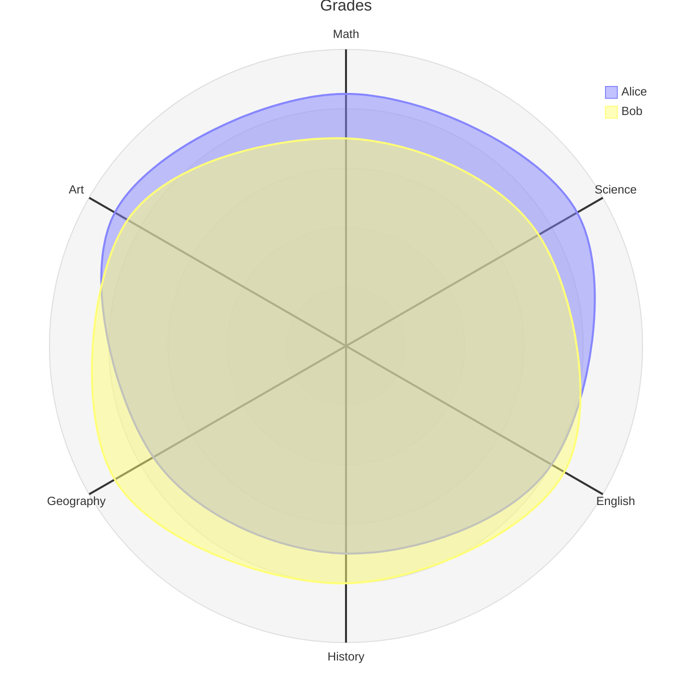
````


---


## Advanced example


````
mermaid
---
config:
  radar:
    axisScaleFactor: 0.25
    curveTension: 0.1
  theme: base
  themeVariables:
    cScale0: "#FF0000"
    cScale1: "#00FF00"
    cScale2: "#0000FF"
    radar:
      curveOpacity: 0
---
radar-beta
  axis A, B, C, D, E
  curve c1{1,2,3,4,5}
  curve c2{5,4,3,2,1}
  curve c3{3,3,3,3,3}
````

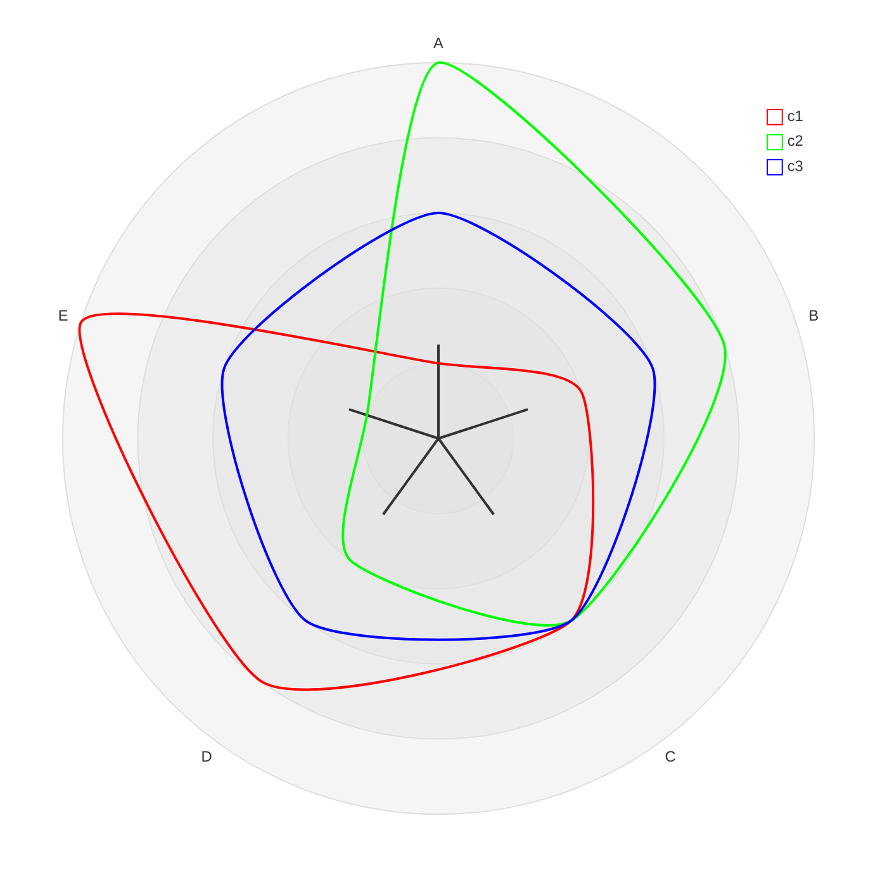


---


# Class Diagrams


## Comments

````
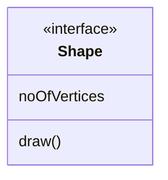
````


----

## Setting the direction of the diagram


````
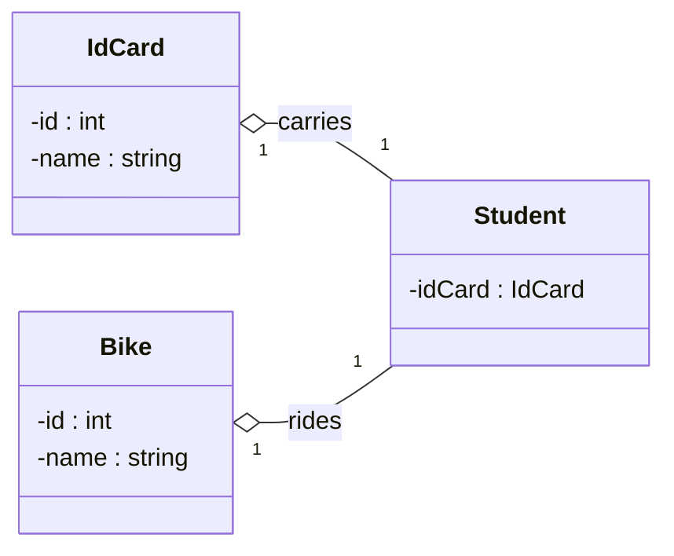
````


---


## Notes

````
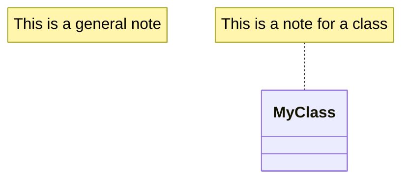
````


----


## Requirement Diagram


````
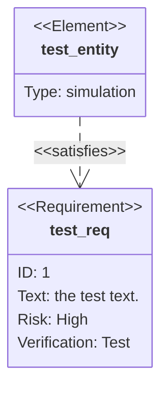
````


---

## Define Namespace

A namespace groups classes.


````
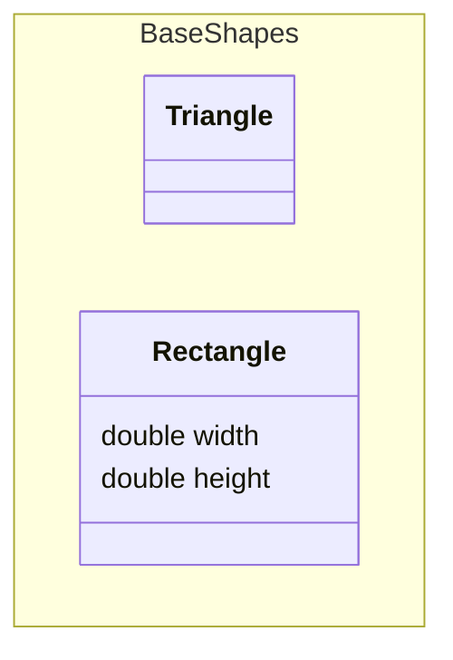
````


---

## Cardinality / Multiplicity on relations

```md
[classA] "cardinality1" [Arrow] "cardinality2" [ClassB]:LabelText
```

````
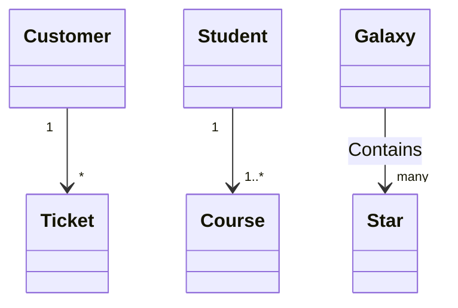
````


---


## URL Link for class diagrams

````
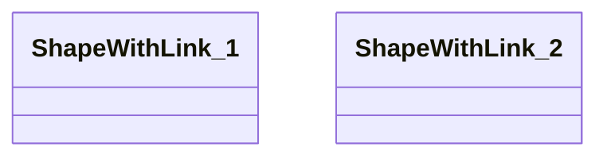
````


---


## Styling a node class diagram

````
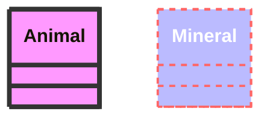
````


---


````
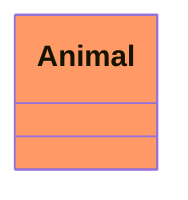
````

```mermaid
classDiagram
    class Animal:::someclass
    classDef someclass fill:#f96
```


---


````
```mermaid
classDiagram
    class Animal:::someclass {
        -int sizeInFeet
        -canEat()
    }
    classDef someclass fill:#f96
```
````

```mermaid
classDiagram
    class Animal:::someclass {
        -int sizeInFeet
        -canEat()
    }
    classDef someclass fill:#f96
```


---

## Default class


```
classDef default fill:#f2f,stroke:#333,stroke-width:4px;
```


````
```mermaid
classDiagram
  class Animal:::pink
  class Mineral

  classDef default fill:#f96,color:red
  classDef pink color:#f2f
```
````

```mermaid
classDiagram
  class Animal:::pink
  class Mineral

  classDef default fill:#f96,color:red
  classDef pink color:#f2f
```


---

# Gantt Chart

## gantt Configuration

`mermaid.ganttConfig` can be set to a JSON string with config parameters or the corresponding object.

```javascript
mermaid.ganttConfig = {
  titleTopMargin: 25, // Margin top for the text over the diagram
  barHeight: 20, // The height of the bars in the graph
  barGap: 4, // The margin between the different activities in the gantt diagram
  topPadding: 75, // Margin between title and gantt diagram and between axis and gantt diagram.
  rightPadding: 75, // The space allocated for the section name to the right of the activities
  leftPadding: 75, // The space allocated for the section name to the left of the activities
  gridLineStartPadding: 10, // Vertical starting position of the grid lines
  fontSize: 12, // Font size
  sectionFontSize: 24, // Font size for sections
  numberSectionStyles: 1, // The number of alternating section styles
  axisFormat: '%d/%m', // Date/time format of the axis
  tickInterval: '1week', // Axis ticks
  topAxis: true, // When this flag is set, date labels will be added to the top of the chart
  displayMode: 'compact', // Turns compact mode on
  weekday: 'sunday', // On which day a week-based interval should start
};
```

---

## Syntax for Gantt chart

```mermaid-example
gantt
    dateFormat  YYYY-MM-DD
    title       Adding GANTT diagram functionality to mermaid
    excludes    weekends
    %% (`excludes` accepts specific dates in YYYY-MM-DD format, days of the week ("sunday") or "weekends", but not the word "weekdays".)

    section A section
    Completed task            :done,    des1, 2014-01-06,2014-01-08
    Active task               :active,  des2, 2014-01-09, 3d
    Future task               :         des3, after des2, 5d
    Future task2              :         des4, after des3, 5d

    section Critical tasks
    Completed task in the critical line :crit, done, 2014-01-06,24h
    Implement parser and jison          :crit, done, after des1, 2d
    Create tests for parser             :crit, active, 3d
    Future task in critical line        :crit, 5d
    Create tests for renderer           :2d
    Add to mermaid                      :until isadded
    Functionality added                 :milestone, isadded, 2014-01-25, 0d

    section Documentation
    Describe gantt syntax               :active, a1, after des1, 3d
    Add gantt diagram to demo page      :after a1  , 20h
    Add another diagram to demo page    :doc1, after a1  , 48h

    section Last section
    Describe gantt syntax               :after doc1, 3d
    Add gantt diagram to demo page      :20h
    Add another diagram to demo page    :48h
```

```mermaid
gantt
    dateFormat  YYYY-MM-DD
    title       Adding GANTT diagram functionality to mermaid
    excludes    weekends
    %% (`excludes` accepts specific dates in YYYY-MM-DD format, days of the week ("sunday") or "weekends", but not the word "weekdays".)

    section A section
    Completed task            :done,    des1, 2014-01-06,2014-01-08
    Active task               :active,  des2, 2014-01-09, 3d
    Future task               :         des3, after des2, 5d
    Future task2              :         des4, after des3, 5d

    section Critical tasks
    Completed task in the critical line :crit, done, 2014-01-06,24h
    Implement parser and jison          :crit, done, after des1, 2d
    Create tests for parser             :crit, active, 3d
    Future task in critical line        :crit, 5d
    Create tests for renderer           :2d
    Add to mermaid                      :until isadded
    Functionality added                 :milestone, isadded, 2014-01-25, 0d

    section Documentation
    Describe gantt syntax               :active, a1, after des1, 3d
    Add gantt diagram to demo page      :after a1  , 20h
    Add another diagram to demo page    :doc1, after a1  , 48h

    section Last section
    Describe gantt syntax               :after doc1, 3d
    Add gantt diagram to demo page      :20h
    Add another diagram to demo page    :48h
```

Tasks are by default sequential. A task start date defaults to the end date of the preceding task.

A colon, `:`, separates the task title from its metadata.
Metadata items are separated by a comma, `,`. Valid tags are `active`, `done`, `crit`, and `milestone`. Tags are optional, but if used, they must be specified first.
After processing the tags, the remaining metadata items are interpreted as follows:

1. If a single item is specified, it determines when the task ends. It can either be a specific date/time or a duration. If a duration is specified, it is added to the start date of the task to determine the end date of the task, taking into account any exclusions.
2. If two items are specified, the last item is interpreted as in the previous case. The first item can either specify an explicit start date/time (in the format specified by `dateFormat`) or reference another task using `after <otherTaskID> [[otherTaskID2 [otherTaskID3]]...]`. In the latter case, the start date of the task will be set according to the latest end date of any referenced task.
3. If three items are specified, the last two will be interpreted as in the previous case. The first item will denote the ID of the task, which can be referenced using the `later <taskID>` syntax.

| Metadata syntax                                      | Start date                                          | End date                                              | ID       |
| ---------------------------------------------------- | --------------------------------------------------- | ----------------------------------------------------- | -------- |
| `<taskID>, <startDate>, <endDate>`                   | `startdate` as interpreted using `dateformat`       | `endDate` as interpreted using `dateformat`           | `taskID` |
| `<taskID>, <startDate>, <length>`                    | `startdate` as interpreted using `dateformat`       | Start date + `length`                                 | `taskID` |
| `<taskID>, after <otherTaskId>, <endDate>`           | End date of previously specified task `otherTaskID` | `endDate` as interpreted using `dateformat`           | `taskID` |
| `<taskID>, after <otherTaskId>, <length>`            | End date of previously specified task `otherTaskID` | Start date + `length`                                 | `taskID` |
| `<taskID>, <startDate>, until <otherTaskId>`         | `startdate` as interpreted using `dateformat`       | Start date of previously specified task `otherTaskID` | `taskID` |
| `<taskID>, after <otherTaskId>, until <otherTaskId>` | End date of previously specified task `otherTaskID` | Start date of previously specified task `otherTaskID` | `taskID` |
| `<startDate>, <endDate>`                             | `startdate` as interpreted using `dateformat`       | `enddate` as interpreted using `dateformat`           | n/a      |
| `<startDate>, <length>`                              | `startdate` as interpreted using `dateformat`       | Start date + `length`                                 | n/a      |
| `after <otherTaskID>, <endDate>`                     | End date of previously specified task `otherTaskID` | `enddate` as interpreted using `dateformat`           | n/a      |
| `after <otherTaskID>, <length>`                      | End date of previously specified task `otherTaskID` | Start date + `length`                                 | n/a      |
| `<startDate>, until <otherTaskId>`                   | `startdate` as interpreted using `dateformat`       | Start date of previously specified task `otherTaskID` | n/a      |
| `after <otherTaskId>, until <otherTaskId>`           | End date of previously specified task `otherTaskID` | Start date of previously specified task `otherTaskID` | n/a      |
| `<endDate>`                                          | End date of preceding task                          | `enddate` as interpreted using `dateformat`           | n/a      |
| `<length>`                                           | End date of preceding task                          | Start date + `length`                                 | n/a      |
| `until <otherTaskId>`                                | End date of preceding task                          | Start date of previously specified task `otherTaskID` | n/a      |


> [!NOTE]
> Support for keyword `until` was added in (v10.9.0+).<br/>
> This can be used to define a task which is running until some other specific task or milestone starts.

For simplicity, the table does not show the use of multiple tasks listed with the `after` keyword. Here is an example of how to use it and how it's interpreted:

```mermaid-example
gantt
    apple :a, 2017-07-20, 1w
    banana :crit, b, 2017-07-23, 1d
    cherry :active, c, after b a, 1d
    kiwi   :d, 2017-07-20, until b c
```

```mermaid
gantt
    apple :a, 2017-07-20, 1w
    banana :crit, b, 2017-07-23, 1d
    cherry :active, c, after b a, 1d
    kiwi   :d, 2017-07-20, until b c
```

---


## Excludes - Weekends(v\11.0.0+)


The `excludes` is an _optional_ attribute that accepts specific dates in YYYY-MM-DD format, days of the week ("sunday") or "weekends", but not the word "weekdays".
These date will be marked on the graph, and be excluded from the duration calculation of tasks. Meaning that if there are excluded dates during a task interval, the number of 'skipped' days will be added to the end of the task to ensure the duration is as specified in the code.

#### Weekend (v\11.0.0+)

When excluding weekends, it is possible to configure the weekends to be either Friday and Saturday or Saturday and Sunday. By default weekends are Saturday and Sunday.
To define the weekend start day, there is an _optional_ attribute `weekend` that can be added in a new line followed by either `friday` or `saturday`.

```mermaid-example
gantt
    title A Gantt Diagram Excluding Fri - Sat weekends
    dateFormat YYYY-MM-DD
    excludes weekends
    weekend friday
    section Section
        A task          :a1, 2024-01-01, 30d
        Another task    :after a1, 20d
```

```mermaid
gantt
    title A Gantt Diagram Excluding Fri - Sat weekends
    dateFormat YYYY-MM-DD
    excludes weekends
    weekend friday
    section Section
        A task          :a1, 2024-01-01, 30d
        Another task    :after a1, 20d
```

### Section statements

You can divide the chart into various sections, for example to separate different parts of a project like development and documentation.

To do so, start a line with the `section` keyword and give it a name. (Note that unlike with the [title for the entire chart](#title), this name is _required_.

### Milestones

You can add milestones to the diagrams. Milestones differ from tasks as they represent a single instant in time and are identified by the keyword `milestone`. Below is an example on how to use milestones. As you may notice, the exact location of the milestone is determined by the initial date for the milestone and the "duration" of the task this way: _initial date_+_duration_/2.

```mermaid-example
gantt
    dateFormat HH:mm
    axisFormat %H:%M
    Initial milestone : milestone, m1, 17:49, 2m
    Task A : 10m
    Task B : 5m
    Final milestone : milestone, m2, 18:08, 4m
```

```mermaid
gantt
    dateFormat HH:mm
    axisFormat %H:%M
    Initial milestone : milestone, m1, 17:49, 2m
    Task A : 10m
    Task B : 5m
    Final milestone : milestone, m2, 18:08, 4m
```

---


### Vertical Markers

The `vert` keyword lets you add vertical lines to your Gantt chart, making it easy to highlight important dates like deadlines, events, or checkpoints. These markers extend across the entire chart and are positioned based on the date you provide. Unlike milestones, vertical markers don’t take up a row. They’re purely visual reference points that help break up the timeline and make important moments easier to spot.

```mermaid-example
gantt
    dateFormat HH:mm
    axisFormat %H:%M
    Initial vert : vert, v1, 17:30, 2m
    Task A : 3m
    Task B : 8m
    Final vert : vert, v2, 17:58, 4m
```

```mermaid
gantt
    dateFormat HH:mm
    axisFormat %H:%M
    Initial vert : vert, v1, 17:30, 2m
    Task A : 3m
    Task B : 8m
    Final vert : vert, v2, 17:58, 4m
```

----


## Setting dates

`dateFormat` defines the format of the date **input** of your gantt elements. How these dates are represented in the rendered chart **output** are defined by `axisFormat`.

### Input date format

The default input date format is `YYYY-MM-DD`. You can define your custom `dateFormat`.

```markdown
dateFormat YYYY-MM-DD
```

The following formatting options are supported:

| Input      | Example        | Description                                            |
| ---------- | -------------- | ------------------------------------------------------ |
| `YYYY`     | 2014           | 4 digit year                                           |
| `YY`       | 14             | 2 digit year                                           |
| `Q`        | 1..4           | Quarter of year. Sets month to first month in quarter. |
| `M MM`     | 1..12          | Month number                                           |
| `MMM MMMM` | January..Dec   | Month name in locale set by `dayjs.locale()`           |
| `D DD`     | 1..31          | Day of month                                           |
| `Do`       | 1st..31st      | Day of month with ordinal                              |
| `DDD DDDD` | 1..365         | Day of year                                            |
| `X`        | 1410715640.579 | Unix timestamp                                         |
| `x`        | 1410715640579  | Unix ms timestamp                                      |
| `H HH`     | 0..23          | 24 hour time                                           |
| `h hh`     | 1..12          | 12 hour time used with `a A`.                          |
| `a A`      | am pm          | Post or ante meridiem                                  |
| `m mm`     | 0..59          | Minutes                                                |
| `s ss`     | 0..59          | Seconds                                                |
| `S`        | 0..9           | Tenths of a second                                     |
| `SS`       | 0..99          | Hundreds of a second                                   |
| `SSS`      | 0..999         | Thousandths of a second                                |
| `Z ZZ`     | +12:00         | Offset from UTC as +-HH:mm, +-HHmm, or Z               |


> [!TIP]
> More info in: <https://day.js.org/docs/en/parse/string-format/>

### Output date format on the axis

The default output date format is `YYYY-MM-DD`. You can define your custom `axisFormat`, like `2020-Q1` for the first quarter of the year 2020.

```markdown
axisFormat %Y-%m-%d
```

The following formatting strings are supported:

| Format | Definition                                                                                 |
| ------ | ------------------------------------------------------------------------------------------ |
| %a     | abbreviated weekday name                                                                   |
| %A     | full weekday name                                                                          |
| %b     | abbreviated month name                                                                     |
| %B     | full month name                                                                            |
| %c     | date and time, as "%a %b %e %H:%M:%S %Y"                                                   |
| %d     | zero-padded day of the month as a decimal number \[01,31]                                  |
| %e     | space-padded day of the month as a decimal number \[ 1,31]; equivalent to %\_d             |
| %H     | hour (24-hour clock) as a decimal number \[00,23]                                          |
| %I     | hour (12-hour clock) as a decimal number \[01,12]                                          |
| %j     | day of the year as a decimal number \[001,366]                                             |
| %m     | month as a decimal number \[01,12]                                                         |
| %M     | minute as a decimal number \[00,59]                                                        |
| %L     | milliseconds as a decimal number \[000, 999]                                               |
| %p     | either AM or PM                                                                            |
| %S     | second as a decimal number \[00,61]                                                        |
| %U     | week number of the year (Sunday as the first day of the week) as a decimal number \[00,53] |
| %w     | weekday as a decimal number \[0(Sunday),6]                                                 |
| %W     | week number of the year (Monday as the first day of the week) as a decimal number \[00,53] |
| %x     | date, as "%m/%d/%Y"                                                                        |
| %X     | time, as "%H:%M:%S"                                                                        |
| %y     | year without century as a decimal number \[00,99]                                          |
| %Y     | year with century as a decimal number                                                      |
| %Z     | time zone offset, such as "-0700"                                                          |
| %%     | a literal "%" character                                                                    |


> [!TIP]
> More info in: <https://github.com/d3/d3-time-format/tree/v4.0.0#locale_format>


---

### Axis ticks (v10.3.0+)

The default output ticks are auto. You can custom your `tickInterval`, like `1day` or `1week`.

```markdown
tickInterval 1day
```

The pattern is:

```javascript
/^([1-9][0-9]*)(millisecond|second|minute|hour|day|week|month)$/;
```

> [!TIP]
> More info in: <https://github.com/d3/d3-time#interval_every>

Week-based `tickInterval`s start the week on sunday by default. If you wish to specify another weekday on which the `tickInterval` should start, use the `weekday` option:

```mermaid-example
gantt
  tickInterval 1week
  weekday monday
```

```mermaid
gantt
  tickInterval 1week
  weekday monday
```

> [!WARNING]
> `millisecond` and `second` support was added in v10.3.0


---

## Comments for Gantt chart

````
```mermaid
gantt
    title A Gantt Diagram
    %% This is a comment
    dateFormat YYYY-MM-DD
    section Section
        A task          :a1, 2014-01-01, 30d
        Another task    :after a1, 20d
    section Another
        Task in Another :2014-01-12, 12d
        another task    :24d
```
````


```mermaid
gantt
    title A Gantt Diagram
    %% This is a comment
    dateFormat YYYY-MM-DD
    section Section
        A task          :a1, 2014-01-01, 30d
        Another task    :after a1, 20d
    section Another
        Task in Another :2014-01-12, 12d
        another task    :24d
```


---

## Output in compact mode

The compact mode allows you to display multiple tasks in the same row. Compact mode can be enabled for a gantt chart by setting the display mode of the graph via preceding YAML settings.


````
```mermaid
---
displayMode: compact
---
gantt
    title A Gantt Diagram
    dateFormat  YYYY-MM-DD

    section Section
    A task           :a1, 2014-01-01, 30d
    Another task     :a2, 2014-01-20, 25d
    Another one      :a3, 2014-02-10, 20d
```
````

```mermaid
---
displayMode: compact
---
gantt
    title A Gantt Diagram
    dateFormat  YYYY-MM-DD

    section Section
    A task           :a1, 2014-01-01, 30d
    Another task     :a2, 2014-01-20, 25d
    Another one      :a3, 2014-02-10, 20d
```


---


````
```mermaid
   gantt
      accTitle: My Gantt Chart Accessibility Title
      accDescr: My Gantt Chart Accessibility Description

    title A Gantt Diagram
    dateFormat  YYYY-MM-DD
    section Section
    A task           :a1, 2014-01-01, 30d
    Another task     :after a1  , 20d
    section Another
    Task in sec      :2014-01-12  , 12d
    another task      : 24d

```
````

```mermaid
   gantt
      accTitle: My Gantt Chart Accessibility Title
      accDescr: My Gantt Chart Accessibility Description

    title A Gantt Diagram
    dateFormat  YYYY-MM-DD
    section Section
    A task           :a1, 2014-01-01, 30d
    Another task     :after a1  , 20d
    section Another
    Task in sec      :2014-01-12  , 12d
    another task      : 24d

```

---


## Bar chart (using gantt chart)


````
```mermaid
gantt
    title Git Issues - days since last update
    dateFormat X
    axisFormat %s
    section Issue19062
    71   : 0, 71
    section Issue19401
    36   : 0, 36
    section Issue193
    34   : 0, 34
    section Issue7441
    9    : 0, 9
    section Issue1300
    5    : 0, 5
```
````

```mermaid
gantt
    title Git Issues - days since last update
    dateFormat X
    axisFormat %s
    section Issue19062
    71   : 0, 71
    section Issue19401
    36   : 0, 36
    section Issue193
    34   : 0, 34
    section Issue7441
    9    : 0, 9
    section Issue1300
    5    : 0, 5
```


---

## Timeline (with comments, CSS, config in frontmatter)


````
```mermaid
---
    # Frontmatter config, YAML comments
    title: Ignored if specified in chart
    displayMode: compact     #gantt specific setting but works at this level too
    config:
#        theme: forest
#        themeCSS: " #item36 { fill: CadetBlue } "
        themeCSS: " // YAML supports multiline strings using a newline markers: \n
            #item36 { fill: CadetBlue }       \n

            // Custom marker workaround CSS from forum (below)    \n
            rect[id^=workaround] { height: calc(100% - 50px) ; transform: translate(9px, 25px); y: 0; width: 1.5px; stroke: none; fill: red; }   \n
            text[id^=workaround] { fill: red; y: 100%; font-size: 15px;}
        "
        gantt:
            useWidth: 400
            rightPadding: 0
            topAxis: true  #false
            numberSectionStyles: 2
---
gantt
    title Timeline - Gantt Sampler
    dateFormat YYYY
    axisFormat %y
    %% this next line doesn't recognise 'decade' or 'year', but will silently ignore
    tickInterval 1decade

    section Issue19062
    71   :            item71, 1900, 1930
    section Issue19401
    36   :            item36, 1913, 1935
    section Issue1300
    94   :            item94, 1910, 1915
    5    :            item5,  1920, 1925
    0    : milestone, item0,  1918, 1s
    9    : vert,              1906, 1s   %% not yet official
    64   : workaround,        1923, 1s   %% custom CSS object https://github.com/mermaid-js/mermaid/issues/3250
```
````


```mermaid
---
    # Frontmatter config, YAML comments
    title: Ignored if specified in chart
    displayMode: compact     #gantt specific setting but works at this level too
    config:
#        theme: forest
#        themeCSS: " #item36 { fill: CadetBlue } "
        themeCSS: " // YAML supports multiline strings using a newline markers: \n
            #item36 { fill: CadetBlue }       \n

            // Custom marker workaround CSS from forum (below)    \n
            rect[id^=workaround] { height: calc(100% - 50px) ; transform: translate(9px, 25px); y: 0; width: 1.5px; stroke: none; fill: red; }   \n
            text[id^=workaround] { fill: red; y: 100%; font-size: 15px;}
        "
        gantt:
            useWidth: 400
            rightPadding: 0
            topAxis: true  #false
            numberSectionStyles: 2
---
gantt
    title Timeline - Gantt Sampler
    dateFormat YYYY
    axisFormat %y
    %% this next line doesn't recognise 'decade' or 'year', but will silently ignore
    tickInterval 1decade

    section Issue19062
    71   :            item71, 1900, 1930
    section Issue19401
    36   :            item36, 1913, 1935
    section Issue1300
    94   :            item94, 1910, 1915
    5    :            item5,  1920, 1925
    0    : milestone, item0,  1918, 1s
    9    : vert,              1906, 1s   %% not yet official
    64   : workaround,        1923, 1s   %% custom CSS object https://github.com/mermaid-js/mermaid/issues/3250
```


---

# Architecture Diagrams Documentation (v11.1.0+)

````
```mermaid
architecture-beta
    group api(cloud)[API]

    service db(database)[Database] in api
    service disk1(disk)[Storage] in api
    service disk2(disk)[Storage] in api
    service server(server)[Server] in api

    db:L -- R:server
    disk1:T -- B:server
    disk2:T -- B:db
```
````


```mermaid
architecture-beta
    group api(cloud)[API]

    service db(database)[Database] in api
    service disk1(disk)[Storage] in api
    service disk2(disk)[Storage] in api
    service server(server)[Server] in api

    db:L -- R:server
    disk1:T -- B:server
    disk2:T -- B:db
```


----


## Junctions

````
```mermaid
architecture-beta
    service left_disk(disk)[Disk]
    service top_disk(disk)[Disk]
    service bottom_disk(disk)[Disk]
    service top_gateway(internet)[Gateway]
    service bottom_gateway(internet)[Gateway]
    junction junctionCenter
    junction junctionRight

    left_disk:R -- L:junctionCenter
    top_disk:B -- T:junctionCenter
    bottom_disk:T -- B:junctionCenter
    junctionCenter:R -- L:junctionRight
    top_gateway:B -- T:junctionRight
    bottom_gateway:T -- B:junctionRight
```
````


```mermaid
architecture-beta
    service left_disk(disk)[Disk]
    service top_disk(disk)[Disk]
    service bottom_disk(disk)[Disk]
    service top_gateway(internet)[Gateway]
    service bottom_gateway(internet)[Gateway]
    junction junctionCenter
    junction junctionRight

    left_disk:R -- L:junctionCenter
    top_disk:B -- T:junctionCenter
    bottom_disk:T -- B:junctionCenter
    junctionCenter:R -- L:junctionRight
    top_gateway:B -- T:junctionRight
    bottom_gateway:T -- B:junctionRight
```

---

## Icons in architecture diagrams

By default, architecture diagram supports the following icons: cloud, database, disk, internet, server. Users can use any of the 200,000+ icons available in iconify.design, or [add custom icons](https://github.com/mermaid-js/mermaid/blob/develop/docs/config/icons.md).


```mermaid
architecture-beta
    group api(logos:aws-lambda)[API]

    service db(logos:aws-aurora)[Database] in api
    service disk1(logos:aws-glacier)[Storage] in api
    service disk2(logos:aws-s3)[Storage] in api
    service server(logos:aws-ec2)[Server] in api

    db:L -- R:server
    disk1:T -- B:server
    disk2:T -- B:db

```

---

# Mermaid Kanban Diagram

## Defining Columns

```mermaid-example
kanban
  column1[Column Title]
    task1[Task Description]
```

```mermaid
kanban
  column1[Column Title]
    task1[Task Description]
```

Syntax: 

```md
columnId[Column Title]
```
- columnId: A unique identifier for the column.
- [Column Title]: The title displayed on the column header.


---

## Supported Metadata Keys


```
•	assigned: Specifies who is responsible for the task.
•	ticket: Links the task to a ticket or issue number.
•	priority: Indicates the urgency of the task. Allowed values: 'Very High', 'High', 'Low' and 'Very Low'
```

```mermaid-example
kanban
todo[Todo]
  id3[Update Database Function]@{ ticket: MC-2037, assigned: 'knsv', priority: 'High' }
```

```mermaid
kanban
todo[Todo]
  id3[Update Database Function]@{ ticket: MC-2037, assigned: 'knsv', priority: 'High' }
```


---

## Configuration Options


```yml
---
config:
  kanban:
    ticketBaseUrl: 'https://yourproject.atlassian.net/browse/#TICKET#'
---
```

```mermaid-example
---
config:
  kanban:
    ticketBaseUrl: 'https://mermaidchart.atlassian.net/browse/#TICKET#'
---
kanban
  Todo
    [Create Documentation]
    docs[Create Blog about the new diagram]
  [In progress]
    id6[Create renderer so that it works in all cases. We also add some extra text here for testing purposes. And some more just for the extra flare.]
  id9[Ready for deploy]
    id8[Design grammar]@{ assigned: 'knsv' }
  id10[Ready for test]
    id4[Create parsing tests]@{ ticket: MC-2038, assigned: 'K.Sveidqvist', priority: 'High' }
    id66[last item]@{ priority: 'Very Low', assigned: 'knsv' }
  id11[Done]
    id5[define getData]
    id2[Title of diagram is more than 100 chars when user duplicates diagram with 100 char]@{ ticket: MC-2036, priority: 'Very High'}
    id3[Update DB function]@{ ticket: MC-2037, assigned: knsv, priority: 'High' }

  id12[Can't reproduce]
    id3[Weird flickering in Firefox]
```

```mermaid
---
config:
  kanban:
    ticketBaseUrl: 'https://mermaidchart.atlassian.net/browse/#TICKET#'
---
kanban
  Todo
    [Create Documentation]
    docs[Create Blog about the new diagram]
  [In progress]
    id6[Create renderer so that it works in all cases. We also add some extra text here for testing purposes. And some more just for the extra flare.]
  id9[Ready for deploy]
    id8[Design grammar]@{ assigned: 'knsv' }
  id10[Ready for test]
    id4[Create parsing tests]@{ ticket: MC-2038, assigned: 'K.Sveidqvist', priority: 'High' }
    id66[last item]@{ priority: 'Very Low', assigned: 'knsv' }
  id11[Done]
    id5[define getData]
    id2[Title of diagram is more than 100 chars when user duplicates diagram with 100 char]@{ ticket: MC-2036, priority: 'Very High'}
    id3[Update DB function]@{ ticket: MC-2037, assigned: knsv, priority: 'High' }

  id12[Can't reproduce]
    id3[Weird flickering in Firefox]
```


---


# Pie chart diagrams

```mermaid-example
---
config:
  pie:
    textPosition: 0.5
  themeVariables:
    pieOuterStrokeWidth: "5px"
---
pie showData
    title Key elements in Product X
    "Calcium" : 42.96
    "Potassium" : 50.05
    "Magnesium" : 10.01
    "Iron" :  5
```


```mermaid
---
config:
  pie:
    textPosition: 0.5
  themeVariables:
    pieOuterStrokeWidth: "5px"
---
pie showData
    title Key elements in Product X
    "Calcium" : 42.96
    "Potassium" : 50.05
    "Magnesium" : 10.01
    "Iron" :  5
```

----

# Quadrant Chart


```mermaid-example
quadrantChart
  title Reach and engagement of campaigns
  x-axis Low Reach --> High Reach
  y-axis Low Engagement --> High Engagement
  quadrant-1 We should expand
  quadrant-2 Need to promote
  quadrant-3 Re-evaluate
  quadrant-4 May be improved
  Campaign A: [0.9, 0.0] radius: 12
  Campaign B:::class1: [0.8, 0.1] color: #ff3300, radius: 10
  Campaign C: [0.7, 0.2] radius: 25, color: #00ff33, stroke-color: #10f0f0
  Campaign D: [0.6, 0.3] radius: 15, stroke-color: #00ff0f, stroke-width: 5px ,color: #ff33f0
  Campaign E:::class2: [0.5, 0.4]
  Campaign F:::class3: [0.4, 0.5] color: #0000ff
  classDef class1 color: #109060
  classDef class2 color: #908342, radius : 10, stroke-color: #310085, stroke-width: 10px
  classDef class3 color: #f00fff, radius : 10
```


```mermaid
quadrantChart
  title Reach and engagement of campaigns
  x-axis Low Reach --> High Reach
  y-axis Low Engagement --> High Engagement
  quadrant-1 We should expand
  quadrant-2 Need to promote
  quadrant-3 Re-evaluate
  quadrant-4 May be improved
  Campaign A: [0.9, 0.0] radius: 12
  Campaign B:::class1: [0.8, 0.1] color: #ff3300, radius: 10
  Campaign C: [0.7, 0.2] radius: 25, color: #00ff33, stroke-color: #10f0f0
  Campaign D: [0.6, 0.3] radius: 15, stroke-color: #00ff0f, stroke-width: 5px ,color: #ff33f0
  Campaign E:::class2: [0.5, 0.4]
  Campaign F:::class3: [0.4, 0.5] color: #0000ff
  classDef class1 color: #109060
  classDef class2 color: #908342, radius : 10, stroke-color: #310085, stroke-width: 10px
  classDef class3 color: #f00fff, radius : 10
```


---


<!-- ---
>**Licenses:**
>
>- **MIT License:**  [](LICENSE) - Full text in [LICENSE](LICENSE) file.
>
--- -->

<!-- - **Creative Commons Attribution 4.0 International:** [](LICENSE-CC-BY) - Legal details in [LICENSE-CC-BY](LICENSE-CC-BY) and at [Creative Commons official site](http://creativecommons.org/licenses/by/4.0/). -->
