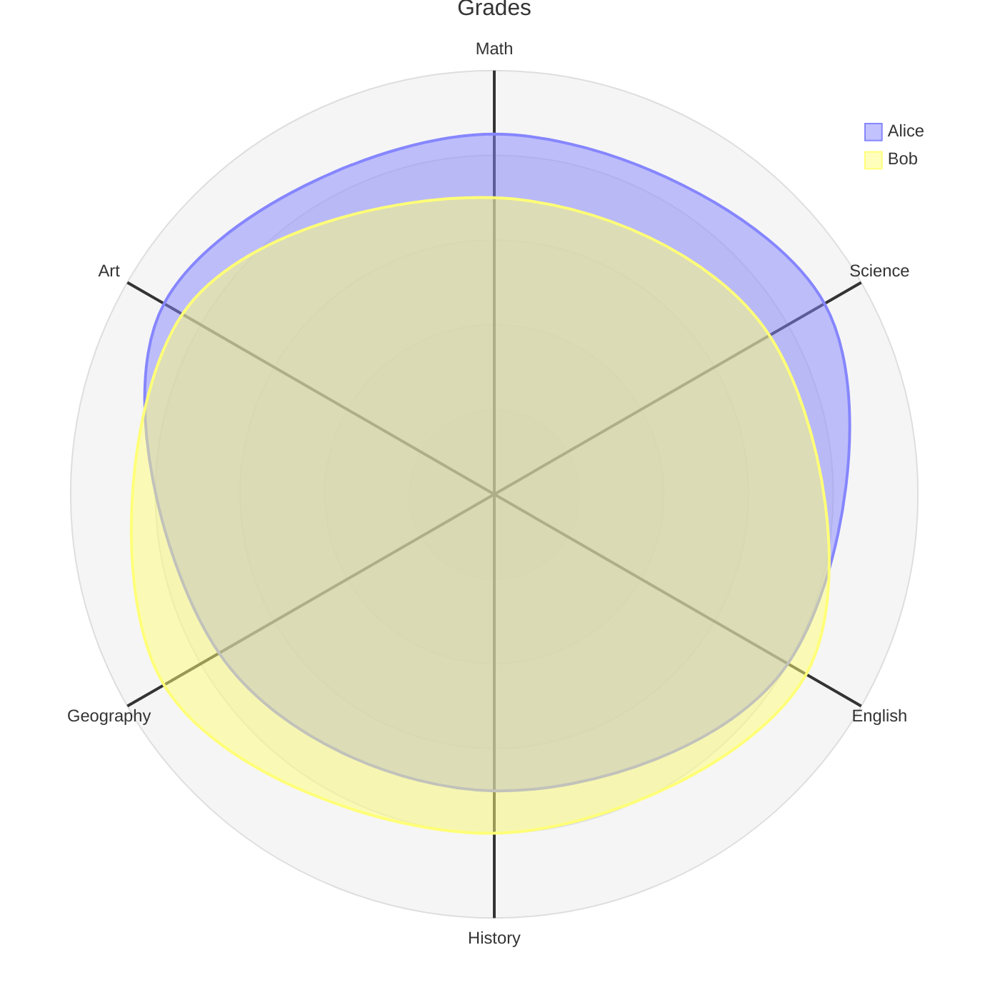
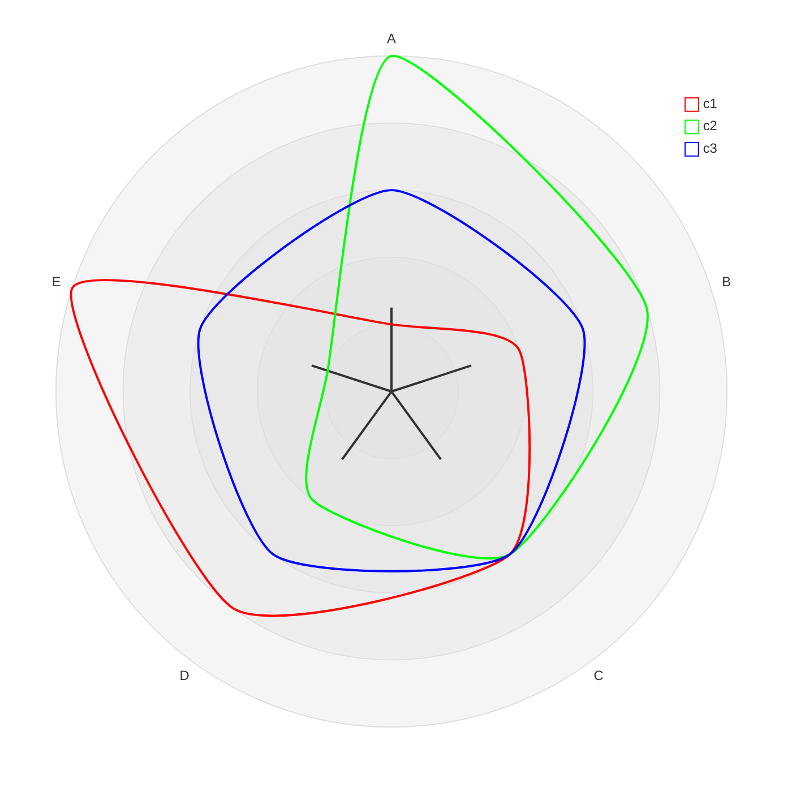

# New Mermaid syntax and diagrams
<!-- > This content is dual-licensed under your choice of the following licenses:
> 1.  **MIT License:** For the code implementations in Swift and Mermaid provided in this document.
> 2.  **Creative Commons Attribution 4.0 International License (CC BY 4.0):** For all other content, including the text, explanations, and the Mermaid diagrams and illustrations. -->

---

## Radar Diagram (v11.6.0+)


## Introduction

A radar diagram is a simple way to plot low-dimensional data in a circular format.

It is also known as a **radar chart**, **spider chart**, **star chart**, **cobweb chart**, **polar chart**, or **Kiviat diagram**.

## Usage

This diagram type is particularly useful for developers, data scientists, and engineers who require a clear and concise way to represent data in a circular format.

It is commonly used to graphically summarize and compare the performance of multiple entities across multiple dimensions.

## Syntax

```md
radar-beta
axis A, B, C, D, E
curve c1{1,2,3,4,5}
curve c2{5,4,3,2,1}
... More Fields ...
```

## Examples

````

````


---


## Advanced example


````
mermaid
---
config:
  radar:
    axisScaleFactor: 0.25
    curveTension: 0.1
  theme: base
  themeVariables:
    cScale0: "#FF0000"
    cScale1: "#00FF00"
    cScale2: "#0000FF"
    radar:
      curveOpacity: 0
---
radar-beta
  axis A, B, C, D, E
  curve c1{1,2,3,4,5}
  curve c2{5,4,3,2,1}
  curve c3{3,3,3,3,3}
````




---


<!-- ---
>**Licenses:**
>
>- **MIT License:**  [](LICENSE) - Full text in [LICENSE](LICENSE) file.
>
--- -->

<!-- - **Creative Commons Attribution 4.0 International:** [](LICENSE-CC-BY) - Legal details in [LICENSE-CC-BY](LICENSE-CC-BY) and at [Creative Commons official site](http://creativecommons.org/licenses/by/4.0/). -->
