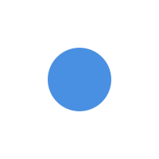
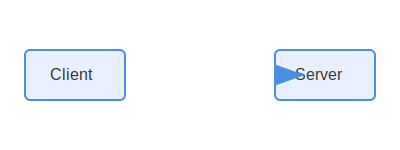
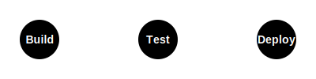
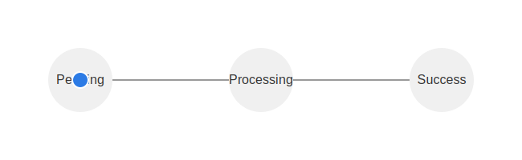

```mermaid
%% Current Mermaid version
info
```  -->


```mermaid
---
title: "C<char>o&#770;</char>ngL<char>e&#770;</char>SolutionX"
author: "Cong Le"
version: "1.0"
license(s): "MIT, CC BY-SA 4.0"
copyright: "Copyright (c) 2025 Cong Le. All Rights Reserved."
config:
  theme: base
---
%%%%%%%% Mermaid version v11.4.1-b.14
%%{
  init: {
    'flowchart': { 'htmlLabels': false },
    'fontFamily': 'Verdana',
    'themeVariables': {
      'primaryColor': '#fc82',
      'primaryTextColor': '#F8B229',
      'primaryBorderColor': '#27AE60',
      'secondaryColor': '#81c784',
      'secondaryTextColor': '#6C3483',
      'lineColor': '#F8B229',
      'fontSize': '20px'
    }
  }
}%%
flowchart LR
  My_Meme@{ img: "https://raw.githubusercontent.com/CongLeSolutionX/CongLeSolutionX/refs/heads/main/assets/images/My-meme-light-bulb-question-marks.png", label: "Ăn uống gì chưa ngừi đẹp?", pos: "b", w: 200, h: 150, constraint: "off" }

  Closing_quote@{ shape: braces, label: "Just do it, differently" }
    
  Closing_quote ~~~ My_Meme
    
  Link_to_my_profile{{"<a href='https://github.com/CongLeSolutionX/CongLeSolutionX' target='_blank'>Click here if you care about the profile of a tech guy seeking for a job 🙏🏼</a>"}}

  Closing_quote ~~~ My_Meme
  My_Meme animatingEdge@--> Link_to_my_profile
  
  animatingEdge@{ animate: true }



```

> ⚠️🏗️🚧🦺🧱🪵🪨🪚🛠️👷
> 
> This is a working draft in progress
> 
> 
>
> gif image is provided by [Giphy](https://giphy.com)
> 
> ⚠️🏗️🚧🦺🧱🪵🪨🪚🛠️👷

----

# Rendering SVG code

Click to show/hide the full disclaimer.

   
> <ins>📢 **Disclaimer** 🚨</ins>
>
> This document contains my personal notes on the topic,
> compiled from publicly available documentation and various cited sources.
> The materials are intended for educational purposes (<ins>sometimes, entertainment purposes</ins>), personal study, and reference.
> The content is dual-licensed:
> 1. **MIT License:** Applies to all code implementations (Swift, Mermaid, and other programming languages).
> 2. **Creative Commons Attribution-ShareAlike 4.0 International License (CC BY-SA 4.0):** Applies to all non-code content, including text, explanations, diagrams, and illustrations.

---

## Practical Animated SVG Scenes for GitHub Markdown

### ⚙️ 1. Loading, Status, and Progress Indicators

These are common UI elements used to provide feedback on an ongoing process.

*   **Spinning Circle Loader** 🌀: A classic circular progress indicator with a rotating, incomplete border.

*   **Pulsating Dot Beacon** 🔴: A single dot that gently scales up and down, often used to indicate a "live" or "active" status.

*   **Three-Dot "Thinking" Ellipsis** 💬: Three dots that fade in and out sequentially, mimicking a "typing" or "processing" indicator.

*   **Rotating Gear or Cog** 🛠️: One or more gears spinning, perfect for representing "settings," "configuration," or a "build process."

*   **Filling Progress Bar** 🟩: A simple rectangle that animates its width or a gradient to show completion from 0% to 100%.

*   **Bouncing Ball Loader** 🏀: One or more circles bouncing in place, offering a more playful loading state.

*   **Hourglass Filling Effect** ⏳: An hourglass icon where sand appears to drop from the top to the bottom.

---

### ✨ 2. Informational and Attention-Grabbing Icons

These icons add a subtle touch of motion to draw the user's eye to important information.

*   **Waving Hand "Hello"** 👋: A simple hand icon that performs a gentle waving animation.
*   **Flashing "New" Badge** ✨: A badge with the word "New" that subtly flashes or pulses to highlight a new feature.

*   **Blinking Eye Icon** 👀: An eye that occasionally blinks, useful for "watch this" or "preview" sections.
*   **Toggling Switch (On/Off)** 🌗: A visual switch that animates between its "on" and "off" states.

*   **Pulsating Heart or Star** ❤️: An icon for "Sponsor" or "Featured" sections that has a gentle pulse effect.

*   **Ringing Bell Notification** 🔔: A bell icon that shakes or swings to signify notifications or updates.

*   **Morphing Shape Icon** 💠: An icon that smoothly changes from one shape to another (e.g., square to circle), great for demonstrating concepts like "adaptability" or "transformation."

---

### 📊 3. Simple Diagrams and Flowcharts

These animations help explain processes and data flows more effectively than static images.

*   **Animated Data Flow Path** ➡️: A diagram where lines or arrows light up sequentially to illustrate the path of a request or data.

*   **Build/CI-CD Pipeline Status** 🚦: A sequence of nodes representing build steps that change color (e.g., from grey to yellow to green/red).

*   **Simple State Machine Transition** 🔄: A marker that moves between labeled states in a state diagram to show a change in status.

*   **Client-Server Request/Response** ↔️: An arrow that animates from a "Client" node to a "Server" node and then returns.

> [!NOTE]
> Fixing the positions for each element in the diagram

*   **GitHub `git` Flow Visualization** 🌿: A simplified diagram showing commits appearing sequentially on a `main` or `feature` branch.

---

### 🎨 4. Decorative and Brand Elements

These add a polished, branded touch to a `README.md` file.

*   **Subtle Animated Logo** 🌟: A company or project logo with a slow pulse, a gentle rotation, or a subtle color-shifting effect.

*   **Animated Header Underline** ✒️: A line that animates drawing itself under a section title.

*   **Gradient Background Shift** 🌈: A shape or background with a gradient that slowly and smoothly changes its colors over time.

*   **Text "Handwriting" Effect** ✍️: Text that appears to be drawn on screen by animating the `stroke-dasharray` and `stroke-dashoffset` properties.

---

### 📈 5. Simple Data Visualizations

These can make key data points in your documentation more dynamic and engaging.

*   **Growing Bar Chart** 💹: A simple bar chart where the bars animate their height from zero to their final value upon "loading."

*   **Pie Chart Slice Entrance** 🥧: A pie chart where each slice animates into place, either by growing radially or fanning out.

---

<!-- 

---
>**Licenses:**
>
>- **MIT License:**   - Full text in [LICENSE](LICENSE) file.
>- **Creative Commons Attribution-ShareAlike 4.0 International**: [CC BY-SA 4.0](https://creativecommons.org/licenses/by-sa/4.0/)  - Legal details in [LICENSE-CC-BY-SA-4.0](THE_PAST/LICENSE-CC-BY-SA-4.0) and at [Creative Commons official site](https://creativecommons.org/licenses/by-sa/4.0/).
>
---

>
> ### References
>
>*   **MDN Web Docs:**
>    *   [`@keyframes`](https://developer.mozilla.org/en-US/docs/Web/CSS/@keyframes)
>    *   [`animation`](https://developer.mozilla.org/en-US/docs/Web/CSS/animation)
>    *   [`animation-timing-function`](https://developer.mozilla.org/en-US/docs/Web/CSS/animation-timing-function)
>    *   [`transform`](https://developer.mozilla.org/en-US/docs/Web/CSS/transform)
>*   **W3C Specifications:**
>    *   [CSS Animations Module Level 1](https://www.w3.org/TR/css-animations-1/)
>    *   [CSS Animations Module Level 2](https://drafts.csswg.org/css-animations-2/)
>    *   [Scalable Vector Graphics (SVG) 2](https://www.w3.org/TR/SVG2/)
>